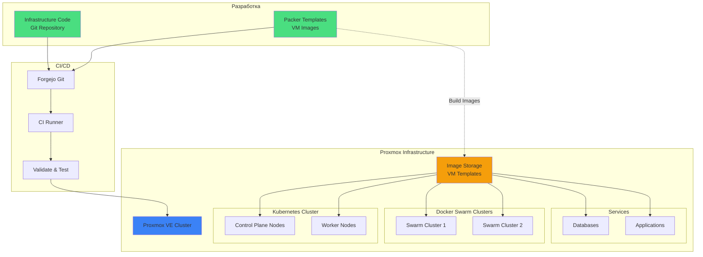
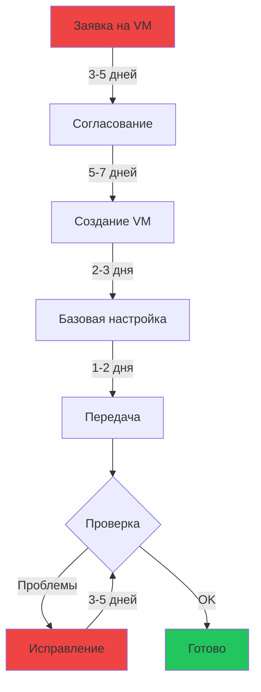
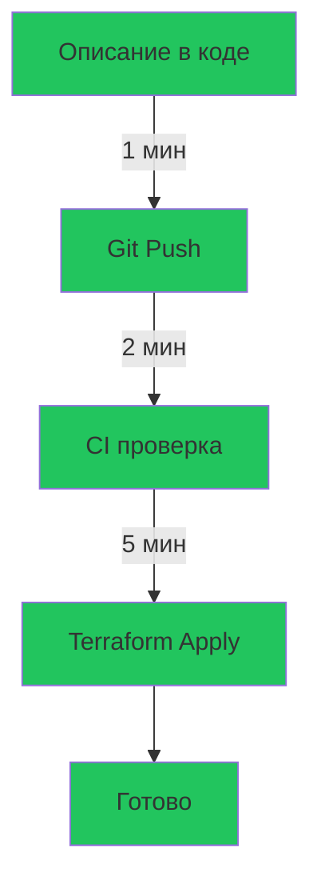

# Infrastructure as Code
## Современный подход к управлению виртуальными машинами

**Proxmox + Packer + Terraform**

От хаоса к порядку

---
layout: section
---

# Текущая ситуация

---

# Проблемы текущего подхода 🔥

<v-clicks>

## Заказ виртуальных машин занимает недели

- 📧 Заявка на создание VM → ожидание 2-3 недели
- ❓ Получаем непонятно что с непонятной конфигурацией
- 🔧 Параметры не соответствуют заказанным

## Сетевые проблемы постоянно

- ✅ HTTP работает (повезло!)
- ❌ Пакеты между кластерами не ходят
- 🗣️ Долгие споры и доказательства, что "что-то не работает"

## Отсутствие стандартизации

- 🎲 Каждая VM - это сюрприз
- 📝 Нет документации конфигураций
- 🔄 Невозможно быстро воспроизвести окружение

</v-clicks>

---
layout: section
---

# Предлагаемое решение

---

# Infrastructure as Code подход 🚀

<v-clicks>

## Что это значит?

**Инфраструктура описывается в виде кода**

```hcl
resource "proxmox_vm_qemu" "k8s_worker" {
  name        = "k8s-worker-01"
  target_node = "pve-node-01"
  memory      = 16384
  cores       = 8
  
  network {
    model   = "virtio"
    bridge  = "vmbr0"
    tag     = 100  # VLAN для кластера
  }
  
  disk {
    storage = "local-lvm"
    size    = "100G"
  }
}
```

**Один клик → готовая VM с правильной конфигурацией**

</v-clicks>

---

# Технологический стек 🛠️

<v-clicks>

## 1. **Proxmox** - платформа виртуализации

- У нас уже есть!
- Мощный API для автоматизации
- Поддержка Terraform

## 2. **Packer** - создание образов VM

- Стандартизированные образы операционных систем
- Предустановленное ПО и настройки
- Версионирование образов

## 3. **Terraform/OpenTofu** - управление инфраструктурой

- Декларативное описание инфраструктуры
- У нас уже есть опыт использования (K8s кластер)
- Контроль версий через Git

</v-clicks>

---

# Архитектура решения 📐



---

# Процесс создания VM: Было vs Станет

<div class="grid grid-cols-2 gap-4">

<div>

## ❌ БЫЛО (2-3 недели)



**Итого: 15-20 рабочих дней**

</div>

<div>

## ✅ СТАНЕТ (5-10 минут)



**Итого: 5-10 минут**

</div>

</div>

---

# Преимущества IaC подхода 💎

<v-clicks depth="2">

## 🚀 Скорость

- **От недель к минутам**: создание VM за 5-10 минут
- **Моментальное масштабирование**: нужно 10 новых worker nodes? Один параметр!
- **Быстрое восстановление**: упала VM? Пересоздаём за минуты

## 🎯 Надёжность

- **Предсказуемый результат**: всегда получаем то, что описали
- **Стандартизация**: все VM создаются по единому шаблону
- **Автоматическое тестирование**: CI проверяет конфигурацию до применения

## 📚 Документация

- **Код = документация**: всё описано явно
- **История изменений**: Git хранит всю историю
- **Code Review**: изменения проходят ревью

</v-clicks>

---

# Преимущества IaC подхода (продолжение) 💎

<v-clicks depth="2">

## 🔒 Безопасность

- **Стандартные образы**: единые настройки безопасности
- **Контроль изменений**: все изменения видны в Git
- **Автоматические обновления**: образы обновляются централизованно

## 💰 Экономия

- **Экономия времени DevOps**: меньше ручной работы
- **Экономия времени администраторов**: меньше рутины
- **Меньше простоев**: быстрое восстановление

## 🔄 Воспроизводимость

- **Dev = Stage = Prod**: одинаковые окружения
- **Disaster Recovery**: быстрое восстановление после сбоя
- **Тестовые окружения**: создаём за минуты

</v-clicks>

---

# Конкретные примеры применения 📋

<v-clicks>

## Сценарий 1: Расширение K8s кластера

```bash
# Было: заявка + 2-3 недели ожидания
# Стало:
terraform apply -var="worker_nodes=5"  # +5 новых worker nodes за 10 минут
```

## Сценарий 2: Новый Swarm кластер

```bash
# Было: месяц на создание и настройку кластера из 6 VM
# Стало:
terraform apply -var="swarm_cluster=true"  # Весь кластер за 15 минут
```

## Сценарий 3: Проблемы с сетью

```hcl
# Было: доказываем админам что не работает неделю
# Стало: всё явно описано в коде
network {
  model   = "virtio"
  bridge  = "vmbr0"
  tag     = 100  # VLAN для inter-cluster связи
  firewall = true
}
```

</v-clicks>

---

# Packer: Стандартизированные образы 📦

<v-clicks>

## Что даёт Packer?

**Создание готовых образов VM с предустановленным ПО**

```hcl
# Ubuntu образ для K8s Worker
source "proxmox-iso" "ubuntu-k8s" {
  iso_file         = "local:iso/ubuntu-22.04-server.iso"
  vm_name          = "ubuntu-k8s-worker-template"
  memory           = 4096
  cores            = 2
  
  # Предустановка
  provisioner "shell" {
    scripts = [
      "scripts/install-docker.sh",
      "scripts/install-kubernetes.sh",
      "scripts/configure-network.sh",
      "scripts/hardening.sh"
    ]
  }
}
```

**Результат**: VM поднимается с уже настроенным ПО

</v-clicks>

---

# Примеры образов для наших кластеров 🖼️

<v-clicks>

## Kubernetes Worker

- Ubuntu 22.04 LTS
- Docker / containerd
- kubelet, kubeadm, kubectl
- Сетевые плагины (Calico/Cilium)
- Мониторинг агенты

## Docker Swarm Node

- Ubuntu 22.04 LTS
- Docker Engine
- Swarm dependencies
- Мониторинг агенты
- Backup агенты

## Database Server

- Ubuntu 22.04 LTS
- PostgreSQL / MySQL
- Backup tools
- Monitoring
- Security hardening

</v-clicks>

---

# Интеграция с существующей инфраструктурой 🔗

<v-clicks>

## У нас уже есть:

✅ **Terraform опыт** - используем для K8s кластера  
✅ **Proxmox** - платформа виртуализации  
✅ **Forgejo** - Git сервер  
✅ **ArgoCD** - GitOps для K8s  
✅ **Мониторинг** - VictoriaMetrics + Loki  

## Просто расширяем:

```
cluster_initial/
├── iac/
│   ├── kubernetes/          # ← Уже есть
│   ├── proxmox-vms/         # ← Добавим
│   │   ├── k8s-nodes/
│   │   ├── swarm-clusters/
│   │   └── databases/
│   └── packer/              # ← Добавим
│       ├── ubuntu-k8s/
│       ├── ubuntu-swarm/
│       └── ubuntu-db/
```

</v-clicks>

---

# План внедрения 📅

<v-clicks depth="2">

## Фаза 1: Подготовка (1-2 недели)

- Настройка Terraform provider для Proxmox
- Создание первых Packer образов (Ubuntu base)
- Настройка CI/CD для IaC

## Фаза 2: Пилот (2-3 недели)

- Создание тестового Swarm кластера через IaC
- Проверка сетевой связности
- Отладка процессов

## Фаза 3: Внедрение (1-2 месяца)

- Миграция создания новых VM на IaC
- Документирование процессов
- Обучение команды

## Фаза 4: Оптимизация (постоянно)

- Расширение библиотеки образов
- Автоматизация дополнительных сценариев
- Улучшение процессов

</v-clicks>

---

# Сравнение подходов 📊

<div class="grid grid-cols-2 gap-4">

<div>

## ❌ Текущий подход

| Критерий | Оценка |
|----------|--------|
| **Скорость создания VM** | 2-3 недели |
| **Предсказуемость** | ❌ Низкая |
| **Стандартизация** | ❌ Нет |
| **Документация** | ❌ Устаревает |
| **Сетевая настройка** | ❌ Проблемы |
| **Воспроизводимость** | ❌ Низкая |
| **Масштабируемость** | ❌ Сложно |
| **Стоимость ошибки** | 🔴 Высокая |

</div>

<div>

## ✅ IaC подход

| Критерий | Оценка |
|----------|--------|
| **Скорость создания VM** | 5-10 минут |
| **Предсказуемость** | ✅ Высокая |
| **Стандартизация** | ✅ Полная |
| **Документация** | ✅ Актуальная |
| **Сетевая настройка** | ✅ В коде |
| **Воспроизводимость** | ✅ 100% |
| **Масштабируемость** | ✅ Легко |
| **Стоимость ошибки** | 🟢 Низкая |

</div>

</div>

---

# Пример кода: K8s Worker Node 💻

```hcl
# Описание worker node для Kubernetes
resource "proxmox_vm_qemu" "k8s_worker" {
  count = var.worker_count  # Количество worker nodes

  name        = "k8s-worker-${count.index + 1}"
  target_node = var.proxmox_node
  clone       = "ubuntu-k8s-template"  # Образ из Packer
  
  # Ресурсы
  memory  = 16384  # 16GB RAM
  cores   = 8
  sockets = 1
  
  # Сеть - ВСЁ ЯВНО ОПИСАНО!
  network {
    model   = "virtio"
    bridge  = "vmbr0"
    tag     = 100        # VLAN для K8s кластера
    firewall = true
  }
  
  # Дополнительная сеть для inter-cluster связи
  network {
    model   = "virtio"
    bridge  = "vmbr1"
    tag     = 200        # VLAN для Swarm связи
  }
  
  # Диски
  disk {
    storage = "local-lvm"
    size    = "100G"
    type    = "scsi"
    ssd     = 1
  }
  
  # Автоматическая настройка при создании
  provisioner "remote-exec" {
    inline = [
      "kubeadm join ${var.k8s_control_plane_endpoint}",
    ]
  }
  
  # Мониторинг
  tags = ["kubernetes", "worker", "production"]
}
```

**Один раз описали - работает всегда одинаково!**

---

# Пример кода: Swarm кластер 💻

```hcl
# Полный Swarm кластер из 6 нод
module "swarm_cluster_production" {
  source = "./modules/swarm-cluster"
  
  cluster_name = "swarm-prod"
  
  # Manager nodes
  manager_count  = 3
  manager_memory = 8192
  manager_cores  = 4
  
  # Worker nodes
  worker_count  = 3
  worker_memory = 16384
  worker_cores  = 8
  
  # Сеть
  cluster_vlan      = 100  # Внутренняя сеть кластера
  inter_cluster_vlan = 200  # Связь с K8s
  
  # Образ
  template_name = "ubuntu-swarm-template"
  
  # Автоматическая инициализация Swarm
  auto_init = true
}
```

**Команда `terraform apply` → готовый кластер за 15 минут!**

---

# ROI: Возврат инвестиций 💰

<v-clicks>

## Инвестиции

- 👨‍💻 2 недели на настройку инфраструктуры
- 📚 1 неделя на документацию и обучение
- **Итого: ~120 часов работы**

## Экономия (ежемесячно)

| Сценарий | Было | Станет | Экономия |
|----------|------|--------|----------|
| Создание 5 VM для нового сервиса | 80 ч | 2 ч | **78 ч/мес** |
| Расширение K8s (3 worker) | 60 ч | 1 ч | **59 ч/мес** |
| Новый Swarm кластер | 120 ч | 2 ч | **118 ч/мес** |
| Тестовое окружение | 40 ч | 1 ч | **39 ч/мес** |
| Отладка сетевых проблем | 30 ч | 5 ч | **25 ч/мес** |

**Итого экономия: ~320 часов в месяц**

## Окупаемость: **2 недели!** 🚀

</v-clicks>

---

# Риски и их митигация ⚠️

<div class="grid grid-cols-2 gap-4">

<div>

## ⚠️ Риски

**Технические**
- Проблемы с Proxmox API
- Ошибки в Terraform коде

**Организационные**
- Сопротивление изменениям
- Недостаток знаний в команде

**Процессные**
- Ошибки в процессе
- Отсутствие стандартов

</div>

<div>

## ✅ Митигация

**Технические**
- Pilot проект на тестовом окружении
- Code review всех изменений
- Автоматическое тестирование

**Организационные**
- Обучение команды
- Документация процессов
- Демонстрация преимуществ

**Процессные**
- Постепенное внедрение
- Обратная связь от команды
- Непрерывное улучшение

</div>

</div>

---

# Аналогичные решения в индустрии 🌍

<v-clicks>

## Это не эксперимент - это стандарт!

**Netflix** - полная автоматизация через IaC  
- Тысячи VM управляются кодом
- Deployment за минуты вместо недель

**Spotify** - Infrastructure as Code с начала  
- Все окружения идентичны
- Zero downtime deployments

**HashiCorp** (создатели Terraform)  
- Практикуют IaC на себе
- Публикуют best practices

**Google/AWS/Azure**  
- Все облачные платформы построены на IaC
- Невозможно управлять масштабом вручную

</v-clicks>

---

# Что мы получим в итоге? 🎁

<v-clicks depth="2">

## Скорость и эффективность

- ⚡ VM за минуты вместо недель
- 🔄 Быстрое масштабирование
- 🚀 Моментальное тиражирование окружений

## Качество и надёжность

- ✅ Предсказуемый результат каждый раз
- 📋 Стандартизированные конфигурации
- 🔒 Встроенная безопасность

## Управляемость

- 📚 Актуальная документация в коде
- 🔍 Полная прозрачность изменений
- ↩️ Откат изменений за секунды

## Независимость

- 🎯 Не ждём администраторов
- 💪 Полный контроль над инфраструктурой
- 🔧 Самообслуживание

</v-clicks>

---
layout: section
---

# Демонстрация

---

# Демо: Создание Swarm кластера 🎬

<v-clicks>

## Шаг 1: Описываем кластер в коде

```bash
vim terraform/swarm-cluster.tf
```

## Шаг 2: Планируем изменения

```bash
terraform plan
# Output: Will create 6 VMs with proper network configuration
```

## Шаг 3: Применяем

```bash
terraform apply
# 10 минут → готовый кластер
```

## Шаг 4: Проверяем

```bash
ssh swarm-manager-01
docker node ls
# 3 managers + 3 workers, all Ready
```

**Всё работает с первого раза!**

</v-clicks>

---

# Следующие шаги 📋

<v-clicks depth="2">

## Немедленно (эта неделя)

1. ✅ Одобрение концепции
2. 🔧 Выделение ресурсов для pilot проекта
3. 👥 Назначение ответственных

## Краткосрочно (2-4 недели)

1. 🛠️ Настройка инфраструктуры (Terraform + Packer)
2. 🧪 Pilot: создание тестового Swarm кластера
3. 📊 Оценка результатов pilot

## Среднесрочно (2-3 месяца)

1. 📈 Масштабирование на все новые VM
2. 📚 Обучение всей команды
3. 📖 Полная документация

## Долгосрочно

1. 🔄 Миграция существующих VM (постепенно)
2. 🚀 Расширение автоматизации
3. 💡 Непрерывное улучшение

</v-clicks>

---
layout: center
class: text-center
---

# Вопросы? 🤔

---
layout: section
---

# Приложения

---

# Приложение А: Технические детали 🔧

## Terraform Provider для Proxmox

```hcl
terraform {
  required_providers {
    proxmox = {
      source  = "telmate/proxmox"
      version = "~> 2.9"
    }
  }
}

provider "proxmox" {
  pm_api_url      = var.proxmox_api_url
  pm_api_token_id = var.proxmox_token_id
  pm_api_token_secret = var.proxmox_token_secret
  pm_tls_insecure = true
}
```

## Packer Builder

```hcl
packer {
  required_plugins {
    proxmox = {
      version = ">= 1.1.0"
      source  = "github.com/hashicorp/proxmox"
    }
  }
}
```

---

# Приложение Б: Структура репозитория 📁

```
cluster_initial/
├── iac/
│   ├── proxmox-vms/                    # Новое: VM инфраструктура
│   │   ├── modules/
│   │   │   ├── k8s-node/               # Модуль для K8s node
│   │   │   ├── swarm-cluster/          # Модуль для Swarm кластера
│   │   │   └── database-vm/            # Модуль для DB серверов
│   │   ├── envs/
│   │   │   ├── dev/
│   │   │   ├── staging/
│   │   │   └── prod/
│   │   └── README.md
│   │
│   ├── packer/                         # Новое: Образы VM
│   │   ├── ubuntu-k8s-worker/
│   │   │   ├── ubuntu.pkr.hcl
│   │   │   └── scripts/
│   │   ├── ubuntu-swarm/
│   │   └── ubuntu-db/
│   │
│   └── kubernetes/                     # Существующее
│       └── ...
│
└── docs/
    └── IAC_RUNBOOK.md                  # Новое: инструкции
```

---

# Приложение В: Пример CI/CD пайплайна 🔄

```yaml
# .forgejo/workflows/infrastructure.yaml
name: Infrastructure CI/CD

on:
  push:
    paths:
      - 'iac/proxmox-vms/**'

jobs:
  validate:
    runs-on: ubuntu-latest
    steps:
      - name: Checkout
        uses: actions/checkout@v3
      
      - name: Terraform Init
        run: terraform init
        working-directory: iac/proxmox-vms/envs/prod
      
      - name: Terraform Validate
        run: terraform validate
      
      - name: Terraform Plan
        run: terraform plan
        env:
          PROXMOX_TOKEN_ID: ${{ secrets.PROXMOX_TOKEN_ID }}
          PROXMOX_TOKEN_SECRET: ${{ secrets.PROXMOX_TOKEN_SECRET }}
  
  apply:
    needs: validate
    if: github.ref == 'refs/heads/main'
    runs-on: ubuntu-latest
    steps:
      - name: Terraform Apply
        run: terraform apply -auto-approve
```

---

# Приложение Г: Мониторинг IaC 📊

<v-clicks>

## Метрики для отслеживания

- ⏱️ Время создания VM (target: < 10 минут)
- ✅ Success rate (target: > 95%)
- 🔄 Количество VM, управляемых через IaC
- 📉 Количество ручных заявок на VM
- ⚡ Время от commit до deployed VM

## Интеграция с существующим мониторингом

```yaml
# VictoriaMetrics
- record: infrastructure:vm_creation_time
  expr: |
    histogram_quantile(0.95,
      rate(terraform_apply_duration_seconds_bucket[5m])
    )

- alert: VMCreationSlow
  expr: infrastructure:vm_creation_time > 600  # > 10 минут
  annotations:
    summary: "VM creation is taking too long"
```

</v-clicks>

---
layout: center
class: text-center
---

# Спасибо за внимание! 🙏

## Давайте сделаем нашу инфраструктуру современной!

**Контакты для вопросов:**  
SRE Team  
m.prigorodov@tetra-soft.ru

---
layout: end
---

# Вместе к автоматизации! 🚀

