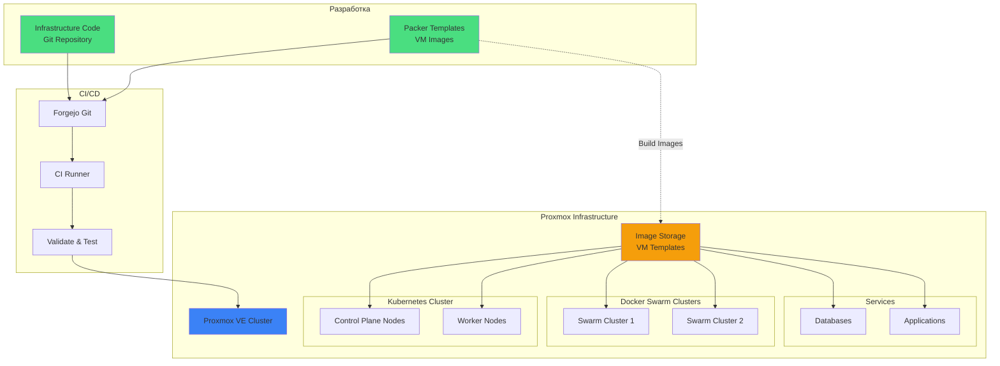
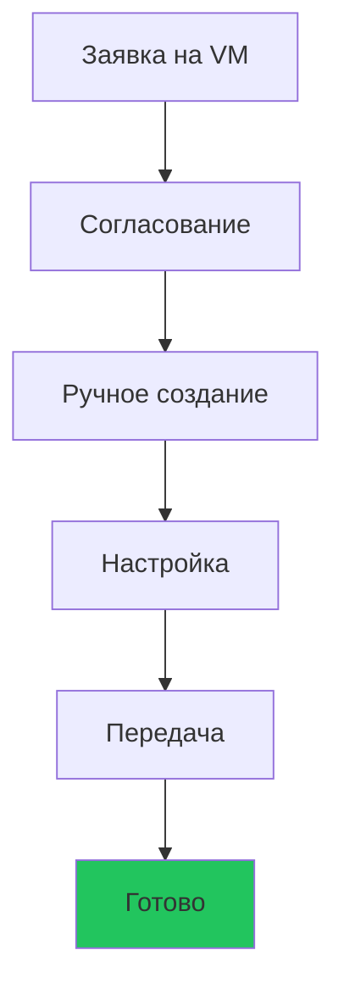
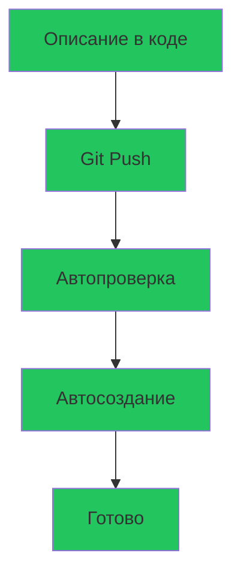

# Infrastructure as Code
## Современный подход к управлению виртуальными машинами

**Proxmox + Packer + Terraform**

От хаоса к порядку

---
layout: section
---

# Текущая ситуация и возможности роста

---

# Что у нас есть сейчас 🎯

<v-clicks>

## Стабильная инфраструктура ✅

- **Proxmox кластер** - надёжная платформа виртуализации
- **Опытная команда администраторов** - знают инфраструктуру изнутри
- **Работающие процессы** - VM создаются, всё функционирует

## Но есть вызовы роста 📈

**Масштабирование затруднено**
- Каждая новая VM требует ручной работы
- Тестовые окружения создаются редко из-за трудоемкости
- Эксперименты с инфраструктурой рискованны

**Инфраструктура "прибита к полу"**
- Сложно быстро масштабироваться при росте нагрузки
- Нет возможности легко тиражировать конфигурации
- Знания об инфраструктуре хранятся "в головах"

</v-clicks>

---
layout: section
---

# Предлагаемое решение

---

# Infrastructure as Code подход 🚀

<v-clicks>

## Расширяем возможности, а не заменяем процессы

**IaC = Инструмент для масштабирования и автоматизации**

- ✅ Админы фокусируются на архитектуре и стратегии
- ✅ Рутинные задачи автоматизируются
- ✅ Инфраструктура становится гибкой и масштабируемой

## Что это значит?

**Инфраструктура описывается в виде кода**

```hcl
resource "proxmox_vm_qemu" "k8s_worker" {
  name        = "k8s-worker-01"
  target_node = "pve-node-01"
  memory      = 16384
  cores       = 8
  
  network {
    model   = "virtio"
    bridge  = "vmbr0"
    tag     = 100  # VLAN для кластера
  }
  
  disk {
    storage = "local-lvm"
    size    = "100G"
  }
}
```

**Один клик → готовая VM с правильной конфигурацией**

</v-clicks>

---

# Технологический стек 🛠️

<v-clicks>

## 1. **Proxmox** - платформа виртуализации

- У нас уже есть!
- Мощный API для автоматизации
- Поддержка Terraform

## 2. **Packer** - создание образов VM

- Стандартизированные образы операционных систем
- Предустановленное ПО и настройки
- Версионирование образов

## 3. **Terraform/OpenTofu** - управление инфраструктурой

- Декларативное описание инфраструктуры
- У нас уже есть опыт использования (K8s кластер)
- Контроль версий через Git

</v-clicks>

---

# Архитектура решения 📐



---

# Процесс создания VM: Сейчас vs С автоматизацией

<div class="grid grid-cols-2 gap-4">

<div>

## 🔧 Текущий процесс (работает!)



**Надёжно и проверено**

✅ Полный контроль  
✅ Понятный процесс  
⏱️ Время зависит от нагрузки админов

</div>

<div>

## 🚀 С автоматизацией (дополнение)



**Освобождает время админов**

✅ Стандартные VM - автоматически  
✅ Админы - для сложных задач  
⚡ Быстрое масштабирование

</div>

</div>

---

# Преимущества IaC подхода 💎

<v-clicks depth="2">

## 🚀 Скорость и гибкость

- **Самообслуживание DevOps**: создание стандартных VM без ожидания
- **Быстрые эксперименты**: тестовые окружения за минуты
- **Моментальное масштабирование**: рост без узких мест

## 🎯 Освобождение времени админов

- **Меньше рутины**: стандартные задачи автоматизированы
- **Больше времени на важное**: архитектура, оптимизация, развитие
- **Предсказуемая нагрузка**: нет потока однотипных заявок

## 📚 Знания в коде

- **Код = документация**: инфраструктура описана явно
- **Передача знаний**: новые сотрудники видят всё в коде
- **Безопасность при отпусках**: не зависим от одного человека

</v-clicks>

---

# Преимущества IaC подхода (продолжение) 💎

<v-clicks depth="2">

## 🔒 Стандартизация и безопасность

- **Единые стандарты**: образы готовятся один раз, используются везде
- **Контроль изменений**: прозрачность через Git
- **Согласованность**: все VM создаются одинаково

## 💪 Рост возможностей команды

- **Больше делаем, меньше устаём**: автоматизация рутины
- **Больше экспериментов**: легко тестировать новые идеи
- **Быстрее реагируем**: на запросы бизнеса

## 🔄 Гибкость инфраструктуры

- **Dev = Stage = Prod**: идентичные окружения, меньше сюрпризов
- **Disaster Recovery**: быстрое восстановление
- **Легкое масштабирование**: готовы к росту нагрузки

</v-clicks>

---

# Конкретные сценарии применения 📋

<v-clicks>

## Сценарий 1: Срочное расширение K8s кластера

**Ситуация**: Резкий рост нагрузки, нужны дополнительные worker nodes

```bash
# Раньше: создать заявку, ждать, координировать с админами
# С IaC: DevOps делает сам
terraform apply -var="worker_nodes=5"  # +5 worker nodes за 10 минут
```

**Результат**: Админы освобождены от срочных заявок в нерабочее время

## Сценарий 2: Тестовое окружение

**Ситуация**: Нужно протестировать миграцию базы данных

```bash
# Раньше: редко делали из-за трудоемкости
# С IaC: создаём копию окружения легко
terraform apply -var="env=test"  # Полная копия prod за 20 минут
```

**Результат**: Меньше рисков в production, больше тестирования

## Сценарий 3: Документирование инфраструктуры

```hcl
# Конфигурация сети явно описана в коде
# Новый сотрудник или коллега видит всё
network {
  model   = "virtio"
  bridge  = "vmbr0"
  tag     = 100  # VLAN для inter-cluster связи
}
```

**Результат**: Знания не теряются при отпусках/увольнениях

</v-clicks>

---

# Packer: Стандартизированные образы 📦

<v-clicks>

## Что даёт Packer?

**Создание готовых образов VM с предустановленным ПО**

```hcl
# Ubuntu образ для K8s Worker
source "proxmox-iso" "ubuntu-k8s" {
  iso_file         = "local:iso/ubuntu-22.04-server.iso"
  vm_name          = "ubuntu-k8s-worker-template"
  memory           = 4096
  cores            = 2
  
  # Предустановка
  provisioner "shell" {
    scripts = [
      "scripts/install-docker.sh",
      "scripts/install-kubernetes.sh",
      "scripts/configure-network.sh",
      "scripts/hardening.sh"
    ]
  }
}
```

**Результат**: VM поднимается с уже настроенным ПО

</v-clicks>

---

# Примеры образов для наших кластеров 🖼️

<v-clicks>

## Kubernetes Worker

- Ubuntu 22.04 LTS
- Docker / containerd
- kubelet, kubeadm, kubectl
- Сетевые плагины (Calico/Cilium)
- Мониторинг агенты

## Docker Swarm Node

- Ubuntu 22.04 LTS
- Docker Engine
- Swarm dependencies
- Мониторинг агенты
- Backup агенты

## Database Server

- Ubuntu 22.04 LTS
- PostgreSQL / MySQL
- Backup tools
- Monitoring
- Security hardening

</v-clicks>

---

тзь# Роль администраторов в IaC 👥

<v-clicks>

## Не замена, а усиление возможностей! 💪

**Администраторы остаются ключевыми**

### Стратегическая роль

- 🏗️ **Архитектура**: проектирование и развитие инфраструктуры
- 🔒 **Безопасность**: политики, сетевая архитектура, compliance
- 📊 **Оптимизация**: производительность, мониторинг, capacity planning
- 🎓 **Экспертиза**: консультирование, best practices, сложные кейсы

### Освобождаются от рутины

- ❌ Создание однотипных VM вручную
- ❌ Повторяющиеся настройки
- ❌ Срочные заявки в нерабочее время
- ❌ Координация простых задач

### IaC = инструмент в руках админов

- ✅ Админы создают шаблоны и образы
- ✅ Админы контролируют инфраструктуру через Code Review
- ✅ Админы фокусируются на развитии, а не поддержке

</v-clicks>

---

# Интеграция с существующей инфраструктурой 🔗

<v-clicks>

## У нас уже есть:

✅ **Terraform опыт** - используем для K8s кластера  
✅ **Proxmox** - платформа виртуализации  
✅ **Forgejo** - Git сервер  
✅ **ArgoCD** - GitOps для K8s  
✅ **Мониторинг** - VictoriaMetrics + Loki  

## Просто расширяем:

```
cluster_initial/
├── iac/
│   ├── kubernetes/          # ← Уже есть
│   ├── proxmox-vms/         # ← Добавим
│   │   ├── k8s-nodes/
│   │   ├── swarm-clusters/
│   │   └── databases/
│   └── packer/              # ← Добавим
│       ├── ubuntu-k8s/
│       ├── ubuntu-swarm/
│       └── ubuntu-db/
```

</v-clicks>

---

# План внедрения 📅

<v-clicks depth="2">

## Фаза 1: Подготовка (1-2 недели)

- Настройка Terraform provider для Proxmox
- Создание первых Packer образов (Ubuntu base)
- Настройка CI/CD для IaC

## Фаза 2: Пилот (2-3 недели)

- Создание тестового Swarm кластера через IaC
- Проверка сетевой связности
- Отладка процессов

## Фаза 3: Внедрение (1-2 месяца)

- Миграция создания новых VM на IaC
- Документирование процессов
- Обучение команды

## Фаза 4: Оптимизация (постоянно)

- Расширение библиотеки образов
- Автоматизация дополнительных сценариев
- Улучшение процессов

</v-clicks>

---

# Сравнение подходов 📊

<div class="grid grid-cols-2 gap-4">

<div>

## 🔧 Текущий подход (ручное управление)

| Критерий | Оценка |
|----------|--------|
| **Гибкость** | ⚠️ Ограничена |
| **Нагрузка на админов** | 🟠 Зависит от потока заявок |
| **Скорость масштабирования** | ⚠️ Линейная с ресурсами |
| **Документация** | ⚠️ Требует актуализации |
| **Тестирование изменений** | ⚠️ Редко из-за сложности |
| **Передача знаний** | ⚠️ Требует времени |
| **Готовность к росту** | ⚠️ Ограничена |

**Работает стабильно для текущих потребностей**

</div>

<div>

## 🚀 С автоматизацией (IaC)

| Критерий | Оценка |
|----------|--------|
| **Гибкость** | ✅ Высокая |
| **Нагрузка на админов** | ✅ Снижена, фокус на важном |
| **Скорость масштабирования** | ✅ Экспоненциальная |
| **Документация** | ✅ Всегда актуальна (код) |
| **Тестирование изменений** | ✅ Легко и безопасно |
| **Передача знаний** | ✅ Через код |
| **Готовность к росту** | ✅ Неограниченная |

**Готовность к будущему росту компании**

</div>

</div>

---

# Пример кода: K8s Worker Node 💻

```hcl
# Описание worker node для Kubernetes
resource "proxmox_vm_qemu" "k8s_worker" {
  count = var.worker_count  # Количество worker nodes

  name        = "k8s-worker-${count.index + 1}"
  target_node = var.proxmox_node
  clone       = "ubuntu-k8s-template"  # Образ из Packer
  
  # Ресурсы
  memory  = 16384  # 16GB RAM
  cores   = 8
  sockets = 1
  
  # Сеть - ВСЁ ЯВНО ОПИСАНО!
  network {
    model   = "virtio"
    bridge  = "vmbr0"
    tag     = 100        # VLAN для K8s кластера
    firewall = true
  }
  
  # Дополнительная сеть для inter-cluster связи
  network {
    model   = "virtio"
    bridge  = "vmbr1"
    tag     = 200        # VLAN для Swarm связи
  }
  
  # Диски
  disk {
    storage = "local-lvm"
    size    = "100G"
    type    = "scsi"
    ssd     = 1
  }
  
  # Автоматическая настройка при создании
  provisioner "remote-exec" {
    inline = [
      "kubeadm join ${var.k8s_control_plane_endpoint}",
    ]
  }
  
  # Мониторинг
  tags = ["kubernetes", "worker", "production"]
}
```

**Один раз описали - работает всегда одинаково!**

---

# Пример кода: Swarm кластер 💻

```hcl
# Полный Swarm кластер из 6 нод
module "swarm_cluster_production" {
  source = "./modules/swarm-cluster"
  
  cluster_name = "swarm-prod"
  
  # Manager nodes
  manager_count  = 3
  manager_memory = 8192
  manager_cores  = 4
  
  # Worker nodes
  worker_count  = 3
  worker_memory = 16384
  worker_cores  = 8
  
  # Сеть
  cluster_vlan      = 100  # Внутренняя сеть кластера
  inter_cluster_vlan = 200  # Связь с K8s
  
  # Образ
  template_name = "ubuntu-swarm-template"
  
  # Автоматическая инициализация Swarm
  auto_init = true
}
```

**Команда `terraform apply` → готовый кластер за 15 минут!**

---

# Инвестиции и выгоды 💰

<v-clicks>

## Инвестиции

- 👨‍💻 2 недели DevOps на настройку инфраструктуры
- 📚 1 неделя на документацию и обучение  
- 🤝 Минимальное участие админов (консультации)
- **Итого: ~120 часов DevOps**

## Выгоды (при росте нагрузки)

| Сценарий | Без автоматизации | С IaC | Выигрыш |
|----------|-------------------|-------|---------|
| Срочное расширение (3 VM) | Ждём админов | DevOps сам | **Автономность** |
| Тестовое окружение | Редко делаем | Делаем часто | **Качество** |
| Стандартизация 20 VM | Ручная работа | Автоматически | **Консистентность** |
| Документация инфраструктуры | Устаревает | Всегда актуальна | **Надёжность** |
| Масштабирование в 2 раза | Линейный рост нагрузки | Та же команда | **Масштабируемость** |

## Главная выгода

**Готовность к росту компании без расширения штата администраторов** 🚀

</v-clicks>

---

# Риски и их митигация ⚠️

<div class="grid grid-cols-2 gap-4">

<div>

## ⚠️ Риски

**Технические**
- Проблемы с Proxmox API
- Ошибки в Terraform коде

**Организационные**
- Сопротивление изменениям
- Недостаток знаний в команде

**Процессные**
- Ошибки в процессе
- Отсутствие стандартов

</div>

<div>

## ✅ Митигация

**Технические**
- Pilot проект на тестовом окружении
- Code review всех изменений
- Автоматическое тестирование

**Организационные**
- Обучение команды
- Документация процессов
- Демонстрация преимуществ

**Процессные**
- Постепенное внедрение
- Обратная связь от команды
- Непрерывное улучшение

</div>

</div>

---

# Аналогичные решения в индустрии 🌍

<v-clicks>

## Это не эксперимент - это стандарт!

**Netflix** - полная автоматизация через IaC  
- Тысячи VM управляются кодом
- Deployment за минуты вместо недель

**Spotify** - Infrastructure as Code с начала  
- Все окружения идентичны
- Zero downtime deployments

**HashiCorp** (создатели Terraform)  
- Практикуют IaC на себе
- Публикуют best practices

**Google/AWS/Azure**  
- Все облачные платформы построены на IaC
- Невозможно управлять масштабом вручную

</v-clicks>

---

# Что мы получим в итоге? 🎁

<v-clicks depth="2">

## Для DevOps/SRE команды

- ⚡ Автономность в стандартных задачах
- 🧪 Возможность экспериментировать без риска
- 📈 Готовность к масштабированию

## Для администраторов

- 🎯 Фокус на архитектуре и развитии
- ⏰ Меньше рутинных задач и срочных заявок
- 🛡️ Стандартизация снижает количество инцидентов

## Для компании

- 📚 Знания задокументированы в коде
- 🚀 Готовность к росту без расширения штата
- 💰 Эффективное использование ресурсов

## Для всех

- 🤝 Сотрудничество через Code Review
- 🔒 Прозрачность и безопасность
- 📊 Инфраструктура как продукт

</v-clicks>

---
layout: section
---

# Демонстрация

---

# Демо: Создание Swarm кластера 🎬

<v-clicks>

## Шаг 1: Описываем кластер в коде

```bash
vim terraform/swarm-cluster.tf
```

## Шаг 2: Планируем изменения

```bash
terraform plan
# Output: Will create 6 VMs with proper network configuration
```

## Шаг 3: Применяем

```bash
terraform apply
# 10 минут → готовый кластер
```

## Шаг 4: Проверяем

```bash
ssh swarm-manager-01
docker node ls
# 3 managers + 3 workers, all Ready
```

**Всё работает с первого раза!**

</v-clicks>

---

# Следующие шаги 📋

<v-clicks depth="2">

## Немедленно (эта неделя)

1. ✅ Одобрение концепции
2. 🔧 Выделение ресурсов для pilot проекта
3. 👥 Назначение ответственных

## Краткосрочно (2-4 недели)

1. 🛠️ Настройка инфраструктуры (Terraform + Packer)
2. 🧪 Pilot: создание тестового Swarm кластера
3. 📊 Оценка результатов pilot

## Среднесрочно (2-3 месяца)

1. 📈 Масштабирование на все новые VM
2. 📚 Обучение всей команды
3. 📖 Полная документация

## Долгосрочно

1. 🔄 Миграция существующих VM (постепенно)
2. 🚀 Расширение автоматизации
3. 💡 Непрерывное улучшение

</v-clicks>

---
layout: center
class: text-center
---

# Вопросы? 🤔

---
layout: section
---

# Приложения

---

# Приложение А: Технические детали 🔧

## Terraform Provider для Proxmox

```hcl
terraform {
  required_providers {
    proxmox = {
      source  = "telmate/proxmox"
      version = "~> 2.9"
    }
  }
}

provider "proxmox" {
  pm_api_url      = var.proxmox_api_url
  pm_api_token_id = var.proxmox_token_id
  pm_api_token_secret = var.proxmox_token_secret
  pm_tls_insecure = true
}
```

## Packer Builder

```hcl
packer {
  required_plugins {
    proxmox = {
      version = ">= 1.1.0"
      source  = "github.com/hashicorp/proxmox"
    }
  }
}
```

---

# Приложение Б: Структура репозитория 📁

```
cluster_initial/
├── iac/
│   ├── proxmox-vms/                    # Новое: VM инфраструктура
│   │   ├── modules/
│   │   │   ├── k8s-node/               # Модуль для K8s node
│   │   │   ├── swarm-cluster/          # Модуль для Swarm кластера
│   │   │   └── database-vm/            # Модуль для DB серверов
│   │   ├── envs/
│   │   │   ├── dev/
│   │   │   ├── staging/
│   │   │   └── prod/
│   │   └── README.md
│   │
│   ├── packer/                         # Новое: Образы VM
│   │   ├── ubuntu-k8s-worker/
│   │   │   ├── ubuntu.pkr.hcl
│   │   │   └── scripts/
│   │   ├── ubuntu-swarm/
│   │   └── ubuntu-db/
│   │
│   └── kubernetes/                     # Существующее
│       └── ...
│
└── docs/
    └── IAC_RUNBOOK.md                  # Новое: инструкции
```

---

# Приложение В: Пример CI/CD пайплайна 🔄

```yaml
# .forgejo/workflows/infrastructure.yaml
name: Infrastructure CI/CD

on:
  push:
    paths:
      - 'iac/proxmox-vms/**'

jobs:
  validate:
    runs-on: ubuntu-latest
    steps:
      - name: Checkout
        uses: actions/checkout@v3
      
      - name: Terraform Init
        run: terraform init
        working-directory: iac/proxmox-vms/envs/prod
      
      - name: Terraform Validate
        run: terraform validate
      
      - name: Terraform Plan
        run: terraform plan
        env:
          PROXMOX_TOKEN_ID: ${{ secrets.PROXMOX_TOKEN_ID }}
          PROXMOX_TOKEN_SECRET: ${{ secrets.PROXMOX_TOKEN_SECRET }}
  
  apply:
    needs: validate
    if: github.ref == 'refs/heads/main'
    runs-on: ubuntu-latest
    steps:
      - name: Terraform Apply
        run: terraform apply -auto-approve
```

---

# Приложение Г: Мониторинг IaC 📊

<v-clicks>

## Метрики для отслеживания

- ⏱️ Время создания VM (target: < 10 минут)
- ✅ Success rate (target: > 95%)
- 🔄 Количество VM, управляемых через IaC
- 📉 Количество ручных заявок на VM
- ⚡ Время от commit до deployed VM

## Интеграция с существующим мониторингом

```yaml
# VictoriaMetrics
- record: infrastructure:vm_creation_time
  expr: |
    histogram_quantile(0.95,
      rate(terraform_apply_duration_seconds_bucket[5m])
    )

- alert: VMCreationSlow
  expr: infrastructure:vm_creation_time > 600  # > 10 минут
  annotations:
    summary: "VM creation is taking too long"
```

</v-clicks>

---
layout: center
class: text-center
---

# Спасибо за внимание! 🙏

## Давайте сделаем нашу инфраструктуру современной!

**Контакты для вопросов:**  
SRE Team  
m.prigorodov@tetra-soft.ru

---
layout: end
---

# Вместе к автоматизации! 🚀

