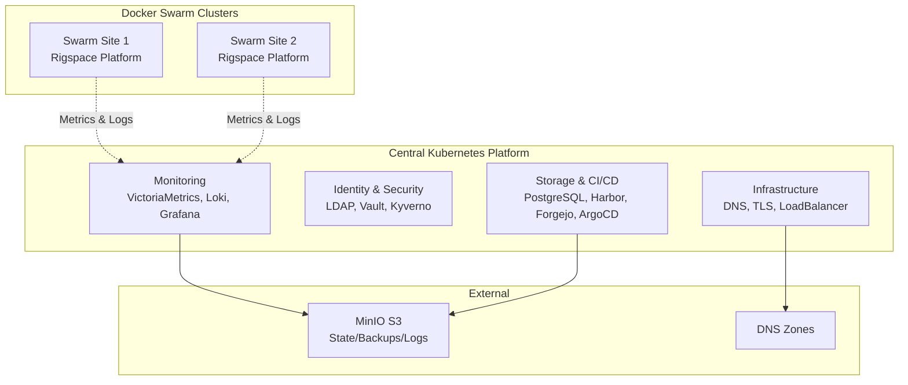
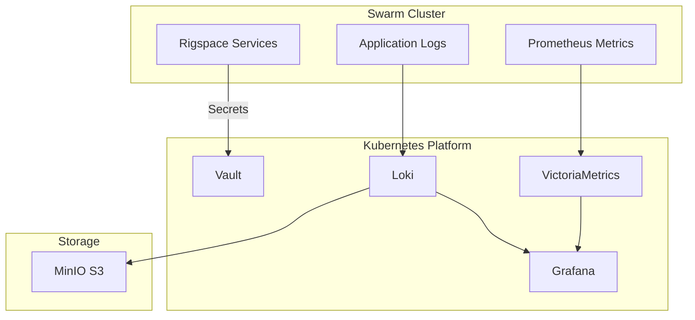

# Единая инфраструктурная платформа

## Kubernetes + Docker Swarm

**Централизованная Kubernetes-платформа**  
**+ распределённые Swarm-кластеры для бизнес-приложений**

---

# Концепция

## Двухуровневая архитектура

- **Kubernetes** — центральная платформа управления
  - Инфраструктурные сервисы (DNS, TLS, CI/CD, мониторинг)
  - Централизованное управление идентификацией и секретами
  - Единая точка наблюдения и логирования

- **Docker Swarm** — бизнес-приложения на площадках
  - Rigspace и другие платформы
  - Распределённые кластеры для разных локаций
  - Автономная работа с интеграцией в центральную платформу

---

# Общая архитектура

---

# Центральная Kubernetes-платформа

## Инфраструктурные сервисы

**DNS & TLS:**
- BIND9 (внутренний DNS) + External DNS (авто-записи)
- Cert-Manager (Let's Encrypt + Internal CA)
- MetalLB + Ingress Nginx

**Идентификация:**
- OpenLDAP (пользователи/группы)
- Vault (секреты, OIDC SSO)
- External Secrets Operator
- Kyverno (policy engine)
- Boundary (SSH/DB доступ)

---

# Центральная Kubernetes-платформа

## Хранение и CI/CD

**Базы данных:**
- PostgreSQL (CloudNativePG Operator)
- Harbor (Docker/Helm registry)
- Nexus3 (artifact repository)

**CI/CD:**
- Forgejo (Git сервер)
- ArgoCD (GitOps)
- Renovate (автообновления)

**Хранилище:**
- External MinIO S3 (state, backups, logs)

---

# Центральная Kubernetes-платформа

## Мониторинг и наблюдаемость

**VictoriaMetrics Stack:**
- VMSingle (метрики)
- VMAgent (сбор)
- VMAlert (алерты)
- Grafana (визуализация)

**Loki Stack:**
- Loki (логи)
- Promtail/Alloy (сбор)
- S3 backend

**Единая платформа** для K8s и Swarm-кластеров

---

# Rigspace Platform (Docker Swarm)

## Архитектура

**Слоистая архитектура:**

1. **Ingress** — Traefik (reverse proxy, TLS)
2. **Config** — Spring Cloud Config Server
3. **Core Services** — Auth, Admin, Monitoring, Analytics, Reporting, Drive
4. **Streaming** — обработка потоковых данных со скважин (WITSML)
5. **Databases** — MariaDB, MongoDB, Redis, ClickHouse, Elasticsearch
6. **Message Queues** — NATS, RabbitMQ
7. **Monitoring** — Prometheus, Grafana, Loki, Tempo

---

# Rigspace Platform

## Основные компоненты

**Core Services:**
- Authentication, Admin, Monitoring, Analytics, Reporting, Drive

**Stream Service:**
- Обработка данных со скважин в реальном времени
- WITSML интеграция
- Connect сервисы

**Сети:**
- `traefik-public` — внешний доступ
- `internal` — межсервисное взаимодействие

**Управление:** Terraform (Infrastructure as Code)

---

# Интеграция K8s ↔ Swarm

## Взаимодействие

**Kubernetes предоставляет Swarm:**

- **Мониторинг** — VictoriaMetrics и Loki собирают метрики/логи
- **Логирование** — централизованное хранение в S3
- **CI/CD** — Forgejo и ArgoCD для управления конфигурацией
- **Безопасность** — Vault для секретов, Boundary для доступа
- **DNS** — BIND9 для единого DNS-пространства
- **TLS** — централизованное управление сертификатами

---

# Интеграция K8s ↔ Swarm

## Потоки данных

---

# Безопасность

## Централизованная модель

**Идентификация:**
- OpenLDAP → Vault (LDAP auth + OIDC)
- OIDC клиенты: Harbor, Forgejo, Grafana, ArgoCD, Boundary

**Управление секретами:**
- Vault (KV v2) → External Secrets Operator → Kubernetes Secrets

**Policy Enforcement:**
- Kyverno (Pod Security Standards, Best Practices)
- Audit mode для постепенного внедрения

**Доступ:**
- Boundary (SSH/DB proxy, zero-trust)

---

# Мониторинг

## Единая платформа наблюдаемости

**Сбор данных:**
- Kubernetes: Promtail (DaemonSet)
- Swarm: Alloy/Prometheus exporters

**Хранение:**
- VictoriaMetrics (метрики)
- Loki (логи) → S3 backend

**Визуализация:**
- Grafana (единые дашборды для всех платформ)
- VMAlert (алертинг)

**Преимущество:** Вся наблюдаемость в одном месте

---

# Эксплуатация

## Управление и масштабирование

**Infrastructure as Code:**
- Terraform/OpenTofu — единая точка управления
- GitOps (ArgoCD) — автоматическое развертывание
- State в S3

**Масштабирование:**
- K8s: горизонтальное через реплики
- Swarm: добавление новых площадок через Terraform

**Backup:**
- Velero (K8s) — scheduled backups в S3
- Swarm: volumes БД + Terraform state

---

# Преимущества

## Для бизнеса

- **Масштабируемость** — легко добавлять новые площадки
- **Надёжность** — изоляция площадок, централизованный backup
- **Единые стандарты** — централизованные политики безопасности
- **Наблюдаемость** — общая картина всех систем

## Для технических команд

- **Автоматизация** — IaC, GitOps, Zero-touch DNS/TLS
- **Безопасность** — централизованная аутентификация, управление секретами
- **Мониторинг** — единая платформа для метрик и логов
- **Упрощённое управление** — декларативная конфигурация

---

# Заключение

## Ключевые достижения

✅ **Единая платформа** — Kubernetes + Docker Swarm  
✅ **Полная автоматизация** — DNS, TLS, развертывание через IaC  
✅ **GitOps** — ArgoCD для декларативного управления  
✅ **Observability** — единая платформа для метрик и логов  
✅ **Security** — централизованная аутентификация и управление секретами  
✅ **Масштабируемость** — легко добавлять новые площадки  
✅ **Backup** — централизованная стратегия резервного копирования  

---

# Production-Ready Platform

**Единая платформа для масштабируемых бизнес-решений** 🚀

**Kubernetes + Docker Swarm = Гибкость + Надёжность + Масштабируемость**

---
layout: center
class: text-center
---

# Спасибо за внимание!

**Вопросы?**

