# Единая инфраструктурная платформа

## Kubernetes + Docker Swarm

**Централизованная Kubernetes-платформа**  
**+ распределённые Swarm-кластеры для бизнес-приложений**

---

# Содержание

1. Введение и концепция
2. Общая архитектура платформы
3. Центральная Kubernetes-инфраструктура
4. Rigspace Platform (Docker Swarm)
5. Интеграция и взаимодействие
6. Безопасность и управление доступом
7. Мониторинг и наблюдаемость
8. Эксплуатация и масштабирование
9. Заключение

---

# Введение

## Концепция платформы

**Двухуровневая архитектура:**

- **Kubernetes** — центральная платформа управления
  - Инфраструктурные сервисы (DNS, TLS, CI/CD, мониторинг)
  - Централизованное управление идентификацией и секретами
  - Единая точка наблюдения и логирования

- **Docker Swarm** — бизнес-приложения на площадках
  - Rigspace и другие платформы
  - Распределённые кластеры для разных локаций
  - Автономная работа с интеграцией в центральную платформу

---

# Введение

## Цели проекта

- **Единая платформа** для инфраструктурных и бизнес-систем (Kubernetes + Swarm)
- **Полная автоматизация**: DNS, TLS, развертывание, backup, мониторинг
- **Безопасность по умолчанию**: централизованная аутентификация и управление секретами
- **Наблюдаемость**: сквозной мониторинг и логирование для всех площадок
- **Масштабируемость**: простое добавление новых площадок и сервисов
- **Упрощение эксплуатации**: всё описано декларативно (Terraform/OpenTofu, GitOps)

---

# Введение

## Преимущества архитектуры

### Для бизнеса
- **Масштабируемость** — легко добавлять новые площадки
- **Единые стандарты** — централизованные политики безопасности
- **Наблюдаемость** — общая картина всех систем
- **Надёжность** — изоляция площадок, централизованный backup

### Для технических команд
- **Автоматизация** — Infrastructure as Code, GitOps
- **Безопасность** — централизованная аутентификация, управление секретами
- **Мониторинг** — единая платформа для метрик и логов
- **Упрощённое управление** — декларативная конфигурация

---

# Общая архитектура платформы

```mermaid
graph TB
    subgraph "Central Kubernetes Platform"
        subgraph "Infrastructure Services"
            BIND9[BIND9 DNS]
            CERT_MGR[Cert-Manager]
            METALLB[MetalLB]
            INGRESS[Ingress Nginx]
        end
        
        subgraph "Identity & Security"
            LDAP[OpenLDAP]
            VAULT[Vault]
            ESO[External Secrets]
            KYVERNO[Kyverno]
            BOUNDARY[Boundary]
        end
        
        subgraph "Storage & CI/CD"
            PG[PostgreSQL]
            HARBOR[Harbor Registry]
            FORGEJO[Forgejo Git]
            ARGOCD[ArgoCD GitOps]
        end
        
        subgraph "Monitoring & Observability"
            PROM[Prometheus]
            THANOS[Thanos]
            LOKI[Loki]
            GRAFANA[Grafana]
        end
        
        subgraph "Backup"
            VELERO[Velero]
        end
    end
    
    subgraph "Docker Swarm Clusters"
        subgraph "Swarm Site 1"
            SWARM1[Docker Swarm<br/>Rigspace Platform]
            TRAEFIK1[Traefik]
            RIGSPACE1[Rigspace Services<br/>Auth, Admin, Monitoring]
            STREAM1[Stream Service]
            DB1[MariaDB, MongoDB<br/>Redis, ClickHouse]
        end
        
        subgraph "Swarm Site 2"
            SWARM2[Docker Swarm<br/>Rigspace Platform]
            TRAEFIK2[Traefik]
            RIGSPACE2[Rigspace Services]
            STREAM2[Stream Service]
            DB2[MariaDB, MongoDB<br/>Redis, ClickHouse]
        end
    end
    
    subgraph "External Services"
        EXT_MINIO[External MinIO S3<br/>State/Backups/Logs]
        LETSENCRYPT[Let's Encrypt]
        DNS_ZONES[DNS Zones]
    end
    
    subgraph "Infrastructure as Code"
        TERRAFORM[Terraform/OpenTofu]
    end
    
    %% Central platform connections
    BIND9 --> DNS_ZONES
    CERT_MGR --> LETSENCRYPT
    METALLB --> INGRESS
    
    %% Identity flow
    LDAP --> VAULT
    VAULT --> ESO
    VAULT --> FORGEJO
    VAULT --> HARBOR
    VAULT --> GRAFANA
    VAULT --> ARGOCD
    VAULT --> BOUNDARY
    
    %% Monitoring connections to Swarm
    PROM --> THANOS
    THANOS --> GRAFANA
    LOKI --> GRAFANA
    LOKI --> EXT_MINIO
    
    %% Swarm to Central integration
    RIGSPACE1 -.->|Metrics| PROM
    RIGSPACE1 -.->|Logs| LOKI
    RIGSPACE2 -.->|Metrics| PROM
    RIGSPACE2 -.->|Logs| LOKI
    
    %% Swarm internal
    TRAEFIK1 --> RIGSPACE1
    TRAEFIK1 --> STREAM1
    RIGSPACE1 --> DB1
    STREAM1 --> DB1
    
    TRAEFIK2 --> RIGSPACE2
    TRAEFIK2 --> STREAM2
    RIGSPACE2 --> DB2
    STREAM2 --> DB2
    
    %% Backup and storage
    VELERO --> EXT_MINIO
    HARBOR --> EXT_MINIO
    PG --> EXT_MINIO
    
    %% IaC
    TERRAFORM --> EXT_MINIO
    TERRAFORM --> SWARM1
    TERRAFORM --> SWARM2
```

---

# Базовая инфраструктура

## DNS Infrastructure

### BIND9
- Внутренний DNS сервер
- RFC2136 динамические обновления
- TSIG ключи для безопасности
- CI\CD управление кастомными DNS записями

### External DNS
- Автоматическая синхронизация DNS записей
- Интеграция с Kubernetes Services и Ingress
- Поддержка FQDN template

---

# DNS Flow

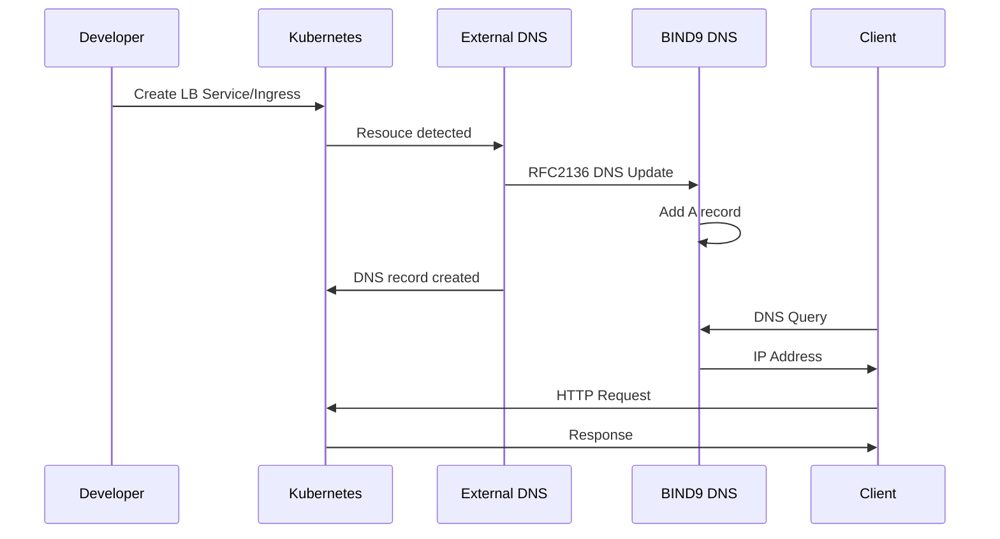

---

# Базовая инфраструктура

### DNS Records Self-Service Repository
- **Отдельный CI/CD репозиторий** для управления DNS записями и SSH хостами
- Единая структура данных для DNS, Boundary и AWX
- **A записи** для хостов с IP адресами
- **SRV записи** для service discovery (SSH, metrics, monitoring targets)
- **Группировка хостов** для Boundary host sets и AWX inventories
- **Remote state интеграция** с основным репозиторием для Boundary/AWX конфигурации
- GitOps workflow через Forgejo Actions
- Используется как единый слой service discovery для Prometheus/Grafana, Boundary и AWX

---

### DNS Records Self-Service Flow

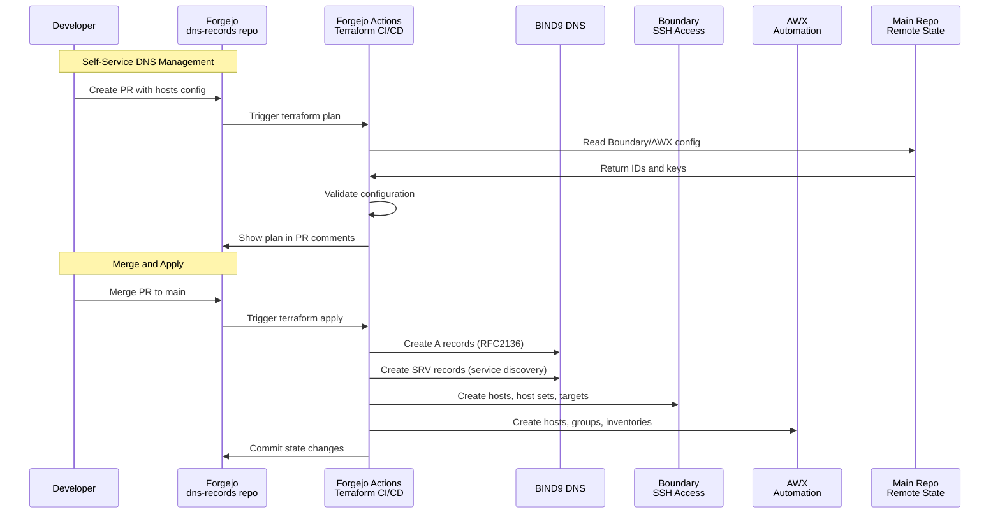

---

# Базовая инфраструктура

## TLS Management

### Cert-Manager
- Автоматическое управление TLS сертификатами
- DNS-01 challenge (BIND9, CloudFlare)
- HTTP-01 challenge
- Let's Encrypt интеграция

### Internal CA
- Внутренний Certificate Authority
- Self-signed сертификаты для внутренних сервисов
- ClusterIssuer для автоматической выдачи

---

### TLS Certificate Flow

##### Public Certificates (Let's Encrypt)

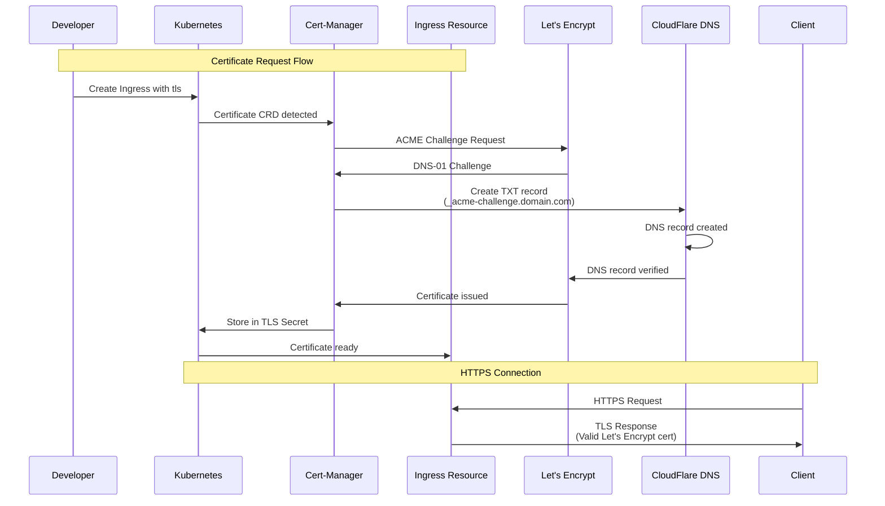
---

### TLS Certificate Flow

##### Internal Certificates (Self-Signed CA)

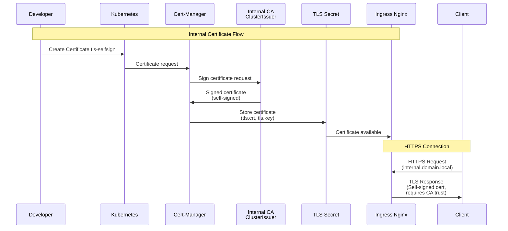

---

# Базовая инфраструктура

## Load Balancing

### MetalLB
- LoadBalancer для bare-metal кластеров
- L2 режим балансировки
- Настраиваемый IP pool (172.15.172.210-225)

### Ingress Nginx
- HTTP/HTTPS маршрутизация
- SSL/TLS termination
- Интеграция с Cert-Manager для автоматических сертификатов

---

# Хранение данных

## PostgreSQL

### CloudNativePG Operator
- Современный PostgreSQL Operator для Kubernetes
- Управление кластерами через Cluster CRD
- Автоматическое создание и управление базами данных
- Managed Roles для автоматического управления пользователями через Kubernetes Secrets

### Архитектура кластера
- **Primary и Replicas** - поддержка высокой доступности с автоматическим failover
- **Типы сервисов**:
  - `{cluster}-rw` - read-write (primary)
  - `{cluster}-ro` - read-only (replicas)
  - `{cluster}-pooler` - connection pooler

---

# Хранение данных

## PostgreSQL

### Управление базами данных
- **Database CRD** - декларативное создание баз данных
- Автоматическое создание пользователей через managed roles
- Управление паролями через Kubernetes Secrets
- Отдельные базы для Grafana, Harbor, Boundary, AWX

### Connection Pooling
- **PgBouncer Pooler** - опциональный connection pooler
- Используется transaction pooling там, где возможно
- Настраиваемое количество реплик pooler
- Типы: rw (read-write), ro (read-only), r (read)

---

# Хранение данных

## PostgreSQL

### Резервное копирование
- **Barman** - интеграция с S3-совместимым хранилищем
- **ScheduledBackup** - автоматические бэкапы по расписанию (Cron)
- WAL архивирование с сжатием
- Retention policy для управления хранением
- Бэкапы с предпочтением standby инстансов

### Мониторинг и хранилище
- **PodMonitor** - интеграция с Prometheus Operator
- Метрики PostgreSQL для Prometheus/Grafana
- Persistent volumes для данных
- Настраиваемый StorageClass и масштабируемый размер

## Nexus3

- Artifact Repository Manager
- Maven, npm, PyPI repositories
- S3 backend для blob storage
- LDAP интеграция

---

# Хранение данных

## Harbor

- Enterprise-grade Docker и Helm registry
- Встроенная проверка безопасности контейнерных образов через **Trivy**
- Автоматическое сканирование артефактов и приоритезация уязвимостей (Critical / High / Medium)
- OIDC интеграция через Vault с маппингом openldap групп
- S3 backend для хранения образов
- Helm ChartMuseum

---

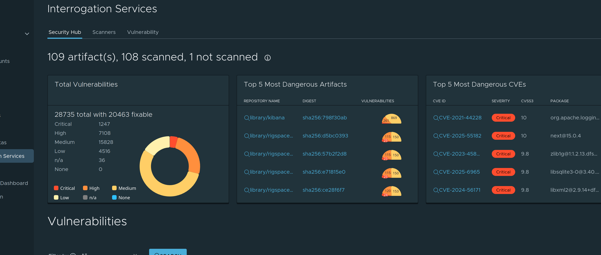

- Централизованный дашборд уязвимостей по всем контейнерным образам
- Топ наиболее опасных артефактов и CVE для фокусной отработки
- Отдельная статистика по количеству уязвимостей и доле **fixable** проблем

---

# Идентификация и безопасность

## OpenLDAP

- Централизованная аутентификация
- CI\CD процесс управления пользователями и группами
- Deep интеграция с Vault - oidc клиенты получают группы и соответствующие права в других сервисах

---

## Direct LDAP Authentication

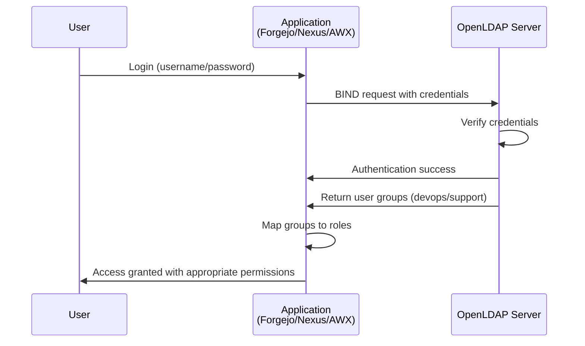

---

# Идентификация и безопасность

## Vault

- HashiCorp Vault для управления секретами
- KV v2 secrets engine
- LDAP authentication method
- OIDC provider для SSO
- SSH secret engine (ssh CA) работает в связке с Boundary
- Интеграция с OpenLDAP
- OIDC клиенты для: Harbor, Forgejo, Grafana, ArgoCD, Boundary
- Kubernetes auth method для External Secrets Operator

---

##### Vault OIDC Authentication Flow

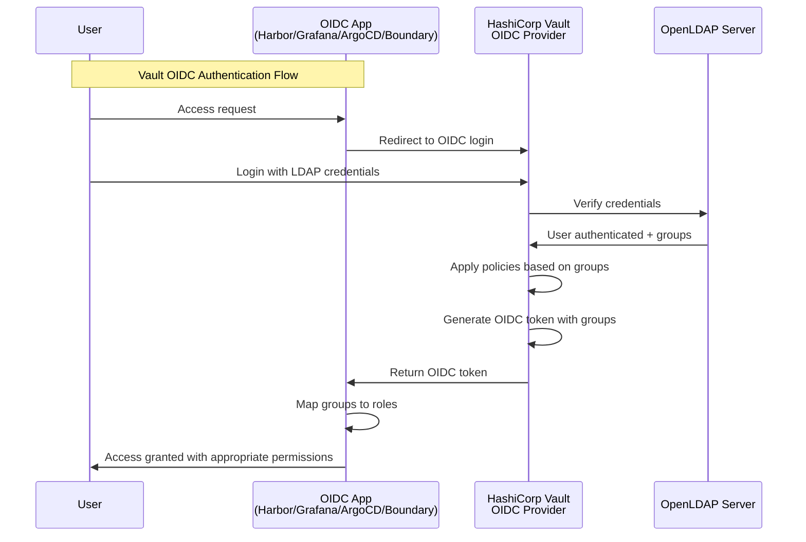

---

# Authentication Flow

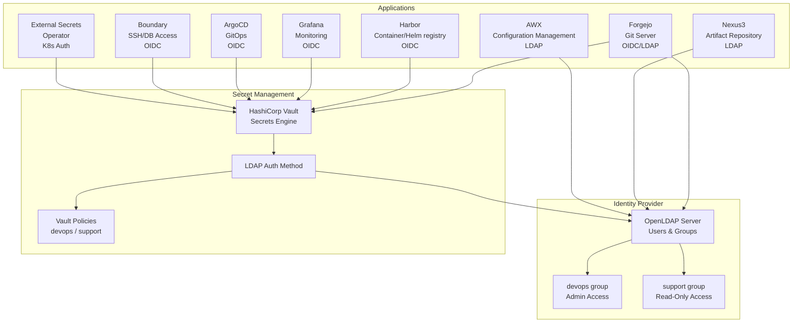

---

# Идентификация и безопасность

## External Secrets Operator

- Автоматическая синхронизация секретов из Vault
- ClusterSecretStore для Vault
- Kubernetes auth method
- Periodic refresh секретов

---

# Идентификация и безопасность

## Boundary

- HashiCorp Boundary для безопасного доступа к инфраструктуре
- Контроль сессий подключения
- OIDC SSO через Vault
- Централизованная точка доступа на основе OpenLdap групп, которые привязаны к vault policies
- **SSH доступ** - безопасное прокси подключение к серверам без управления ключами
- **database доступ** - прокси для internal баз данных
- Controller и Worker архитектура
- PostgreSQL для хранения состояния
- Интеграция с OpenLDAP через Vault OIDC

---

# Идентификация и безопасность

## Boundary Use Cases

### SSH Access
- Безопасный доступ к серверам без управления SSH ключами
- Централизованное управление доступом
- Аудит всех SSH сессий
- Временные сессии с автоматическим истечением

### Database Connection
- Защищённые подключения к базам данных
- Динамические credentials через Vault
- Аудит всех database подключений

---

### Boundary Access Flow

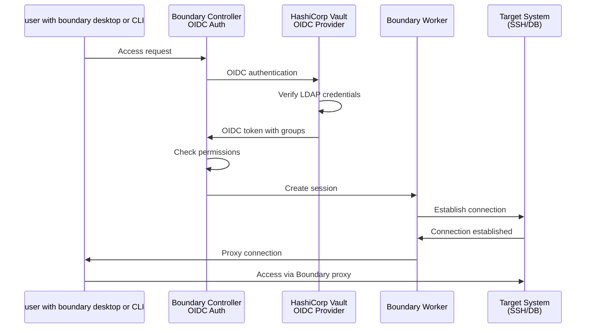

---

# Идентификация и безопасность

## Kyverno

- Kubernetes-native policy engine
- Policy validation и enforcement
- Resource mutation
- Background scanning
- PolicyReports для анализа

### Текущее состояние

- **Режим работы:** Audit Mode (логирование нарушений без блокировки)
- **Всего политик:** 12 активных политик безопасности
- **Background scanning:** включен
- Автоматическая проверка всех ресурсов на соответствие политикам безопасности

---

# Rigspace Platform (Docker Swarm)

## Обзор

**Rigspace** — комплексная микросервисная платформа для нефтегазовой отрасли

- Обработка данных скважин в реальном времени
- Мониторинг и аналитика оборудования
- Генерация отчётов и документов
- Развёрнута на **Docker Swarm** кластерах
- Управляется через **Terraform**

---

# Rigspace Platform

## Архитектура платформы

**Слоистая архитектура:**

1. **Ingress** — Traefik (reverse proxy, TLS termination)
2. **Config** — Spring Cloud Config Server (централизованная конфигурация)
3. **Core Services** — бизнес-логика (Auth, Admin, Monitoring, Analytics, Reporting, Drive)
4. **Stream** — обработка потоковых данных со скважин
5. **Databases** — MariaDB, MongoDB, Redis, ClickHouse, Elasticsearch
6. **Message Queues** — NATS, RabbitMQ
7. **Monitoring** — Prometheus, Grafana, Loki, Tempo

---

# Интеграция Kubernetes ↔ Swarm

## Взаимодействие платформ

### Централизованные сервисы для Swarm-кластеров

**Kubernetes предоставляет:**

- **Мониторинг** — Prometheus и Loki собирают метрики и логи из Swarm
- **Логирование** — централизованное хранение в S3 через Loki
- **CI/CD** — Forgejo и OpenTofu для управления конфигурацией Swarm
- **Безопасность** — Vault для управления секретами, Boundary для доступа
- **DNS** — BIND9 для единого DNS-пространства

---

# Интеграция Kubernetes ↔ Swarm

## Потоки данных

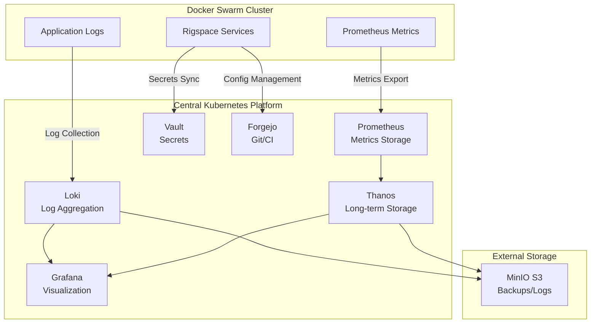

---

# Интеграция Kubernetes ↔ Swarm

## Преимущества интеграции

### Единая точка управления

- **Наблюдаемость** — все метрики и логи в одном месте (Grafana)
- **Автоматизация** — Infrastructure as Code через Terraform

### Изоляция и автономность

- **Независимость площадок** — каждый Swarm-кластер работает автономно
- **Отказоустойчивость** — падение одной площадки не влияет на другие
- **Масштабируемость** — легко добавлять новые площадки

---

# CI/CD платформа

## Forgejo

- Self-hosted Git сервис (Gitea fork)
- Git repositories
- Pull Requests, Issues
- OIDC/LDAP интеграция
- SSH доступ через LoadBalancer

## Forgejo Runner

- CI/CD runners для Forgejo
- Docker-in-Docker
- Act runner для GitHub Actions-совместимых workflows

---

# CI/CD платформа

## DNS Records Self-Service Repository

- **Отдельный Git репозиторий** для управления DNS записями и SSH хостами
- **GitOps workflow** через Forgejo Actions
- **Единая структура данных** - один источник истины для DNS, Boundary и AWX
- **A записи** - автоматическое создание DNS записей для хостов
- **SRV записи** - service discovery для SSH, metrics и других сервисов
- **Группировка хостов** - автоматическое создание Boundary host sets и AWX inventories по группам
- **Remote state интеграция** - получение Boundary/AWX конфигурации из основного репозитория
- **Terraform провайдеры** - hashicorp/dns, hashicorp/boundary, denouche/awx

---

# CI/CD платформа

## ArgoCD

- GitOps continuous delivery
- Declarative GitOps workflow
- OIDC SSO через Vault
- Forgejo/Gitea интеграция
- AppProjects для организации
- Web UI + CLI

---

# CI/CD платформа

## Renovate

- Автоматизация обновления зависимостей
- Автообновление Docker images, Helm charts, Java, Node
- Интеграция с Forgejo
- Dependency Dashboard

---

# Мониторинг и логирование

## Единая платформа наблюдаемости

### Централизованный сбор данных

**Prometheus + Thanos Stack:**
- **Prometheus** — сбор и хранение метрик из Kubernetes и Swarm-кластеров
- **Thanos** — долгосрочное хранение метрик, глобальный запрос
- **Alertmanager** — правила алертинга и уведомления
- **Grafana** — визуализация с OIDC интеграцией

**Loki Stack:**
- **Loki** — индексирование и хранение логов
- **Promtail** — сбор логов из Kubernetes (DaemonSet)
- **Alloy/Prometheus** — сбор логов и метрик из Swarm-кластеров
- **Gateway** — load balancing

---

# Мониторинг и логирование

## Поток данных мониторинга

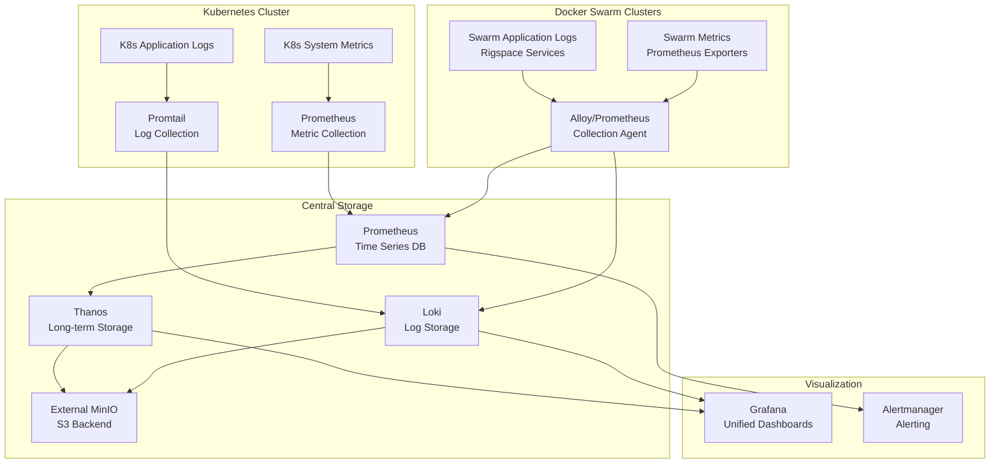

---

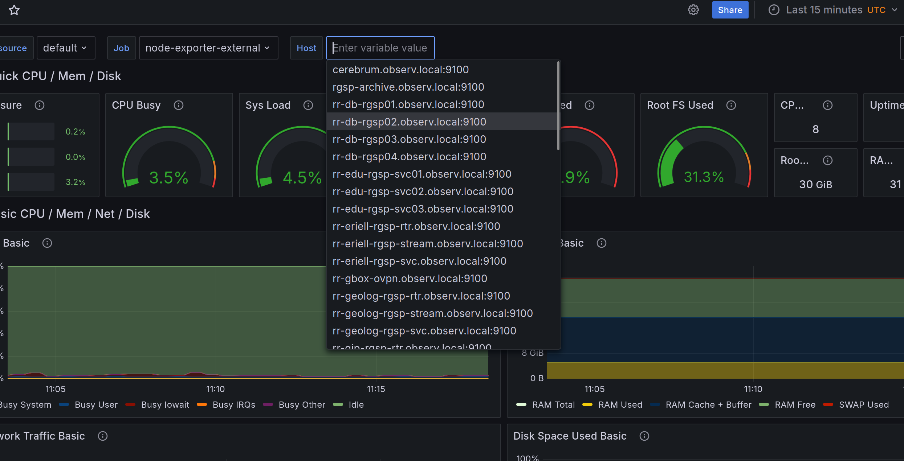

- Prometheus использует SRV-записи для автоматического формирования scrape targets (node-exporter, blackbox и др.)
- В Grafana реализован удобный выбор хоста по переменной, что упрощает анализ метрик по любому серверу

---

# Backup и восстановление

## Velero

- Автоматизация backup и restore для Kubernetes
- Scheduled backups (daily/weekly)
- S3-совместимое хранилище (внешний MinIO)
- Restic для volume backups
- Настраиваемая retention policy
- Выборочный backup по namespaces

### Backup стратегия:
- Daily backup в 2:00 AM
- Weekly backup в 3:00 AM (воскресенье)
- Retention: 30 дней (daily), 60 дней (weekly)
- Namespaces: vault, harbor, forgejo, nexus3, openldap, postgresql, awx, dns-system

---

# Disaster Recovery

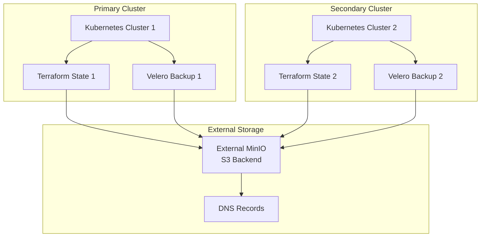

---

# Зависимости и интеграции

## Внешние сервисы

### External MinIO S3
- Используется для:
  - Terraform/OpenTofu state backend
  - Velero backups storage
  - Loki chunks и ruler storage
  - Postgresql backups storage
  - Harbor image store
  - Nexus blob store

### CloudFlare (опционально)
- DNS-01 challenge для Let's Encrypt
- Публичные сертификаты

---

# Security Model

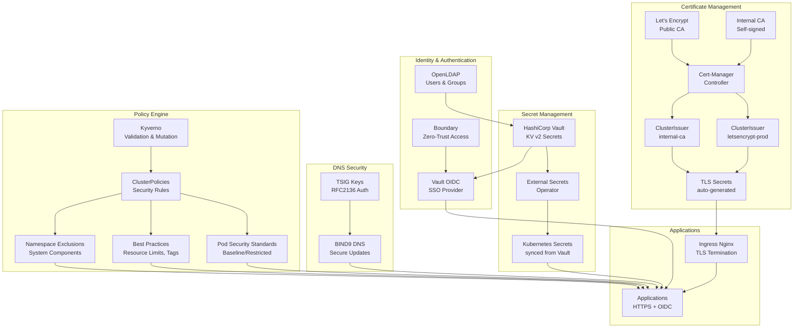

---

# Эксплуатация и масштабирование

## Управление платформой

### Infrastructure as Code

- **Terraform/OpenTofu** — единая точка управления всей инфраструктурой
- **GitOps** — Forgejo для автоматического развертывания
- **Version Control** — все конфигурации в Git
- **State Management** — централизованное хранение state в S3

---

# Эксплуатация и масштабирование

### Масштабирование

**Kubernetes-платформа:**
- Горизонтальное масштабирование через увеличение реплик
- Автоматическое масштабирование на основе метрик (опционально)

**Swarm-площадки:**
- Добавление новых площадок через Terraform
- Независимое масштабирование каждой площадки
- Репликация сервисов внутри Swarm-кластера

---

# Заключение

## Ключевые выводы

### Центральная Kubernetes-платформа
✅ **Полная автоматизация** — DNS, TLS, развертывание  
✅ **Infrastructure as Code** — Terraform/OpenTofu  
✅ **GitOps** — Forgejo для декларативного управления  
✅ **Observability** — единая платформа для метрик (Prometheus + Thanos) и логов (Loki)  
✅ **Security** — policy engine (Kyverno) + secret management (ESO + Vault)  
✅ **Backup** — Velero для disaster recovery  

### Интеграция с бизнес-приложениями
✅ **Масштабируемость** — лёгкое добавление новых Swarm-площадок  
✅ **Централизованный мониторинг** — все метрики и логи в одном месте  
✅ **Единая безопасность** — централизованная аутентификация для всех платформ  
✅ **Автономность** — независимая работа площадок с интеграцией в центр  

---

# Заключение

## Ключевые выводы

### Преимущества для бизнеса
- **Масштабируемость** — легко добавлять новые площадки и сервисы  
- **Надёжность** — изоляция площадок, централизованный backup  
- **Единые стандарты** — централизованные политики безопасности  
- **Наблюдаемость** — общая картина всех систем в одном месте  

### Преимущества для технических команд
- **Автоматизация** — IaC, GitOps, Zero-touch DNS/TLS  
- **Безопасность** — централизованная аутентификация, управление секретами  
- **Мониторинг** — единая платформа для метрик и логов всех систем  
- **Упрощённое управление** — декларативная конфигурация через Terraform  

---

# Заключение

## Архитектурные преимущества

### Двухуровневая модель
- **Kubernetes** — центральная платформа для инфраструктурных сервисов
- **Docker Swarm** — бизнес-приложения на распределённых площадках
- **Интеграция** — единая точка мониторинга, безопасности и управления

### Гибкость и отказоустойчивость
- Независимая работа площадок
- Централизованное управление без жёсткой привязки
- Масштабирование по требованию бизнеса

---

# Production-Ready Infrastructure Platform

**Единая платформа для масштабируемых бизнес-решений** 🚀

**Kubernetes + Docker Swarm = Гибкость + Надёжность + Масштабируемость**

---
layout: center
class: text-center
---

# Спасибо за внимание!

**Вопросы?**
