# Kubernetes Infrastructure Stack

## Production-Ready Infrastructure as Code

**Полнофункциональный Kubernetes кластер**  
**с автоматизацией DNS, TLS, CI/CD и мониторингом**

---

# Содержание

1. Введение и обзор
2. Общая архитектура
3. Базовая инфраструктура
4. Хранение данных
5. Идентификация и безопасность
6. CI/CD платформа
7. Мониторинг и логирование
8. Backup и восстановление
9. Зависимости и интеграции
10. Заключение

---

# Введение

## Цели проекта

- **Infrastructure as Code** - полная автоматизация через Terraform/OpenTofu
- **Zero-touch DNS** - автоматическое создание DNS записей
- **Auto TLS** - автоматическая выдача и обновление сертификатов
- **GitOps** - декларативное управление приложениями
- **Observability** - полный мониторинг и логирование
- **Security** - централизованная аутентификация и управление секретами

---

# Общая архитектура системы

```mermaid
graph TB
    subgraph "Kubernetes Cluster"
        subgraph "Control Plane"
            CP[Control Plane<br/>Talos Linux]
        end
        
        subgraph "Worker Nodes"
            WN1[Worker Node 1<br/>Talos Linux]
            WN2[Worker Node 2<br/>Talos Linux]
        end
        
        subgraph "Infrastructure Services"
            BIND9[BIND9 DNS<br/>RFC2136]
            EXT_DNS[External DNS<br/>Auto Records]
            CERT_MGR[Cert-Manager<br/>Let's Encrypt]
            METALLB[MetalLB<br/>Load Balancer]
            INGRESS[Ingress Nginx<br/>Router]
            CA[Internal CA<br/>Self-signed]
        end
        
        subgraph "Identity & Security"
            LDAP[OpenLDAP<br/>Users/Groups]
            VAULT[Vault<br/>Secrets & OIDC]
            ESO[External Secrets<br/>Operator]
            KYVERNO[Kyverno<br/>Policies]
            BOUNDARY[Boundary<br/>SSH/DB Access]
        end
        
        subgraph "Storage & Databases"
            PG[PostgreSQL<br/>Operator]
            HARBOR[Harbor<br/>Registry]
            NEXUS[Nexus3<br/>Artifacts]
        end
        
        subgraph "CI/CD & GitOps"
            FORGEJO[Forgejo<br/>Git]
            ARGOCD[ArgoCD<br/>GitOps]
            RENOVATE[Renovate<br/>Updates]
        end
        
        subgraph "Monitoring"
            VM[VictoriaMetrics<br/>Metrics]
            LOKI[Loki<br/>Logs]
            GRAFANA[Grafana<br/>Dashboards]
        end
        
        subgraph "Backup"
            VELERO[Velero<br/>Backups]
        end
    end
    
    subgraph "External Services"
        EXT_MINIO[External MinIO S3<br/>State/Backups/Logs]
        LETSENCRYPT[Let's Encrypt<br/>Public Certs]
        INTERNAL_DNS_ZONE[Internal DNS Zone<br/>observ.local]
        REAL_DNS_ZONE[Real DNS Zone<br/>support-tetra-soft.ru]
    end
    
    subgraph "Infrastructure as Code"
        TERRAFORM[Terraform/OpenTofu]
        HELM[Helm Charts]
    end
    
    %% Infrastructure connections
    EXT_DNS --> BIND9
    BIND9 --> INTERNAL_DNS_ZONE
    BIND9 --> REAL_DNS_ZONE
    CERT_MGR --> LETSENCRYPT
    CERT_MGR --> CA
    METALLB --> INGRESS
    
    %% Identity & Auth
    LDAP --> VAULT
    VAULT --> ESO
    VAULT --> FORGEJO
    VAULT --> HARBOR
    VAULT --> GRAFANA
    VAULT --> ARGOCD
    VAULT --> BOUNDARY
    
    %% Storage
    PG --> GRAFANA
    PG --> HARBOR
    PG --> BOUNDARY
    
    %% Monitoring
    VM --> GRAFANA
    LOKI --> GRAFANA
    LOKI --> EXT_MINIO
    
    %% Backup
    VELERO --> EXT_MINIO
    
    %% IaC
    TERRAFORM --> EXT_MINIO
    TERRAFORM --> HELM
```

---

# Базовая инфраструктура

## DNS Infrastructure

### BIND9
- Внутренний DNS сервер
- RFC2136 динамические обновления
- TSIG ключи для безопасности
- CI\CD управление кастомными DNS записями

### External DNS
- Автоматическая синхронизация DNS записей
- Интеграция с Kubernetes Services и Ingress
- Поддержка FQDN template


---

# Базовая инфраструктура

## TLS Management

### Cert-Manager
- Автоматическое управление TLS сертификатами
- DNS-01 challenge (BIND9, CloudFlare)
- HTTP-01 challenge
- Let's Encrypt интеграция

### Internal CA
- Внутренний Certificate Authority
- Self-signed сертификаты для внутренних сервисов
- ClusterIssuer для автоматической выдачи

---

# Базовая инфраструктура

## Load Balancing

### MetalLB
- LoadBalancer для bare-metal кластеров
- L2 режим балансировки
- Настраиваемый IP pool (172.15.172.210-225)

### Ingress Nginx
- HTTP/HTTPS маршрутизация
- SSL/TLS termination
- Интеграция с Cert-Manager для автоматических сертификатов

---

# DNS Flow

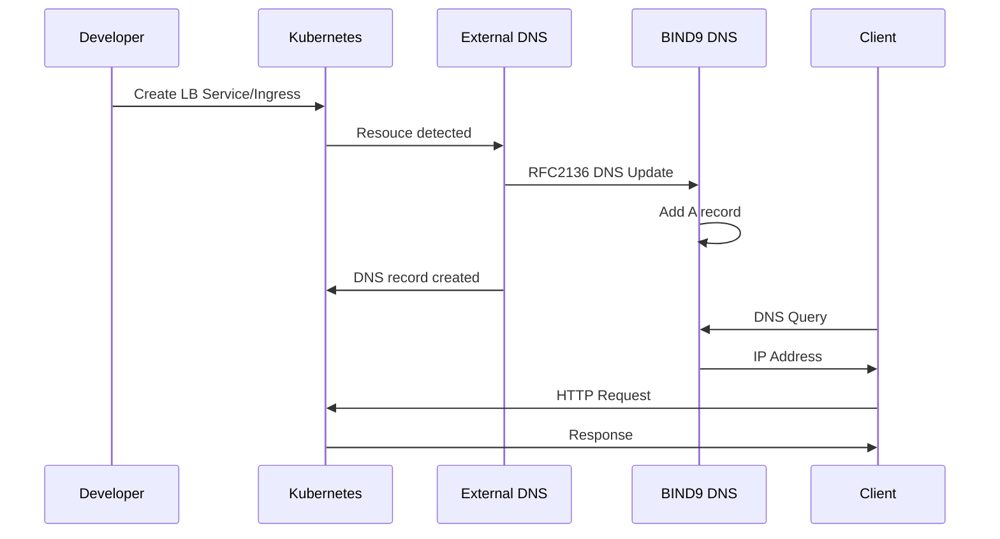

---

### TLS Certificate Flow

##### Public Certificates (Let's Encrypt)

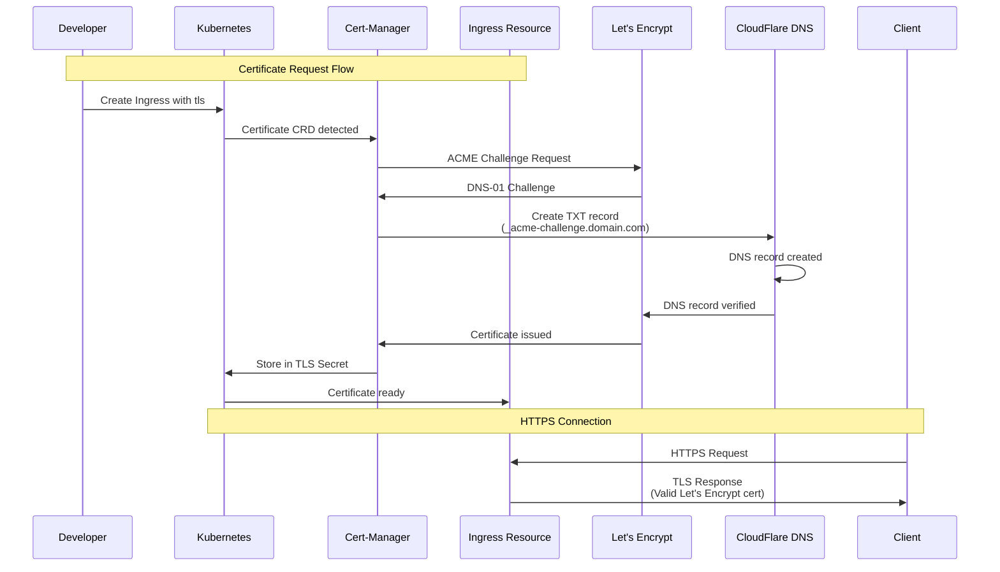
---

### TLS Certificate Flow

##### Internal Certificates (Self-Signed CA)

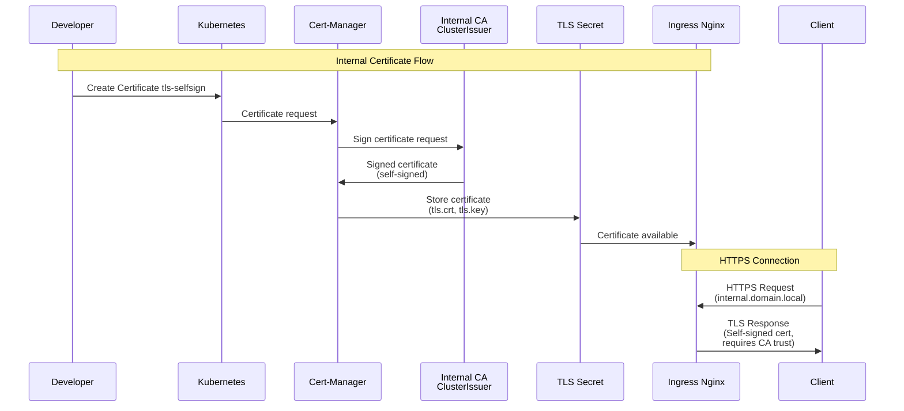

---

# Хранение данных

## PostgreSQL

### CloudNativePG Operator
- Современный PostgreSQL Operator для Kubernetes
- Управление кластерами через Cluster CRD
- Автоматическое создание и управление базами данных
- Managed Roles для автоматического управления пользователями через Kubernetes Secrets

### Архитектура кластера
- **Primary и Replicas** - поддержка высокой доступности с автоматическим failover
- **Типы сервисов**:
  - `{cluster}-rw` - read-write (primary)
  - `{cluster}-ro` - read-only (replicas)
  - `{cluster}-pooler` - connection pooler

---

# Хранение данных

## PostgreSQL

### Управление базами данных
- **Database CRD** - декларативное создание баз данных
- Автоматическое создание пользователей через managed roles
- Управление паролями через Kubernetes Secrets
- Отдельные базы для Grafana, Harbor, Boundary, AWX

### Connection Pooling
- **PgBouncer Pooler** - опциональный connection pooler
- Используется transaction pooling там, где возможно
- Настраиваемое количество реплик pooler
- Типы: rw (read-write), ro (read-only), r (read)

---

# Хранение данных

## PostgreSQL

### Резервное копирование
- **Barman** - интеграция с S3-совместимым хранилищем
- **ScheduledBackup** - автоматические бэкапы по расписанию (Cron)
- WAL архивирование с сжатием
- Retention policy для управления хранением
- Бэкапы с предпочтением standby инстансов

### Мониторинг и хранилище
- **PodMonitor** - интеграция с Prometheus Operator
- Метрики PostgreSQL для VictoriaMetrics/Grafana
- Persistent volumes для данных
- Настраиваемый StorageClass и масштабируемый размер

## Nexus3

- Artifact Repository Manager
- Maven, npm, PyPI repositories
- S3 backend для blob storage
- LDAP интеграция

---

# Хранение данных

## Harbor

- Enterprise-grade Docker и Helm registry
- Trivy для сканирования образов
- OIDC интеграция через Vault с маппингом openldap групп
- S3 backend для хранения образов
- Helm ChartMuseum

---

## Внешний MinIO S3O

- **Внешний сервис** (не часть кластера)
- Используется для:
  - Terraform state backend
  - Velero backups
  - Loki log storage
  - Postgresql Backups
  - Harbor registry
  - Nexus3 repository

---

# Идентификация и безопасность

## OpenLDAP

- Централизованная аутентификация
- CI\CD процесс управления пользователями и группами
- Deep интеграция с Vault - oidc клиенты получают группы и соответствующие права в других сервисах

---

# Идентификация и безопасность

## Vault

- HashiCorp Vault для управления секретами
- KV v2 secrets engine
- LDAP authentication method
- OIDC provider для SSO
- SSH secret engine (ssh CA) работает в связке с Boundary
- Интеграция с OpenLDAP
- OIDC клиенты для: Harbor, Forgejo, Grafana, ArgoCD, Boundary
- Kubernetes auth method для External Secrets Operator

---

# Идентификация и безопасность

## External Secrets Operator

- Автоматическая синхронизация секретов из Vault
- ClusterSecretStore для Vault
- Kubernetes auth method
- Periodic refresh секретов

---

# Идентификация и безопасность

## Boundary

- HashiCorp Boundary для безопасного доступа к инфраструктуре
- Контроль сессий подключения
- OIDC SSO через Vault
- Централизованная точка доступа на основе OpenLdap групп, которые привязаны к vault policies
- **SSH доступ** - безопасное прокси подключение к серверам без управления ключами
- **database доступ** - прокси для internal баз данных
- Controller и Worker архитектура
- PostgreSQL для хранения состояния
- Интеграция с OpenLDAP через Vault OIDC

---

# Идентификация и безопасность

## Kyverno

- Kubernetes-native policy engine
- Policy validation и enforcement
- Resource mutation
- Background scanning
- PolicyReports для анализа

### Текущее состояние

- **Режим работы:** Audit Mode (логирование нарушений без блокировки)
- **Всего политик:** 12 активных политик безопасности
- **Background scanning:** включен
-  ✅ Pass:  844 проверок
-  ❌ Fail:  151 нарушений

---

# Идентификация и безопасность

## Kyverno: Pod Security Standards

Политики безопасности на основе Pod Security Standards (все включены в Audit mode):

- ✅ **Disallow Privileged Containers** - запрет privileged mode
- ✅ **Disallow Host Namespaces** - запрет hostNetwork, hostPID, hostIPC
- ✅ **Require Non-Root User** - требование runAsNonRoot: true
- ✅ **Disallow hostPath Volumes** - запрет hostPath volumes
- ✅ **Disallow Dangerous Capabilities** - запрет SYS_ADMIN, NET_ADMIN и др.
- ✅ **Disallow hostPort** - запрет использования hostPort
- ✅ **Disallow Privilege Escalation** - требование allowPrivilegeEscalation: false

---

# Идентификация и безопасность

## Kyverno: Best Practices

Политики best practices для улучшения качества развертываний:

- ✅ **Require Resource Limits** - обязательные CPU и memory limits (Audit mode)
- ✅ **Disallow Latest Tag** - запрет использования `:latest` тега (Audit mode)
- ✅ **Require ImagePullPolicy** - enforce IfNotPresent или Never (Audit mode)
- ✅ **Disallow Default Namespace** - запрет создания ресурсов в default namespace (Audit mode)
- ⚪ **Require Labels** - обязательные labels (выключено, опционально)
- ⚪ **Require Probes** - liveness и readiness probes (выключено, опционально)

---

# Идентификация и безопасность

## Kyverno: Исключения Namespace

Системные компоненты, требующие привилегий, исключаются из политик:

- `kube-system`, `kube-public`, `kube-node-lease` - системные namespace Kubernetes
- `kyverno` - сам Kyverno
- `metallb-system` - MetalLB требует hostNetwork, hostPort
- `ingress-nginx` - Ingress контроллеры могут требовать привилегий
- `forgejo-runner` - Docker-in-Docker требует privileged mode
- `local-path-storage` - Storage provisioner может требовать hostPath

**Двухуровневая защита:**
1. **Webhook level** - полное исключение из обработки на уровне admission webhook
2. **Policy level** - каждая политика дополнительно проверяет исключения

**Всего исключено:** 8 namespace

---

# Authentication Flow

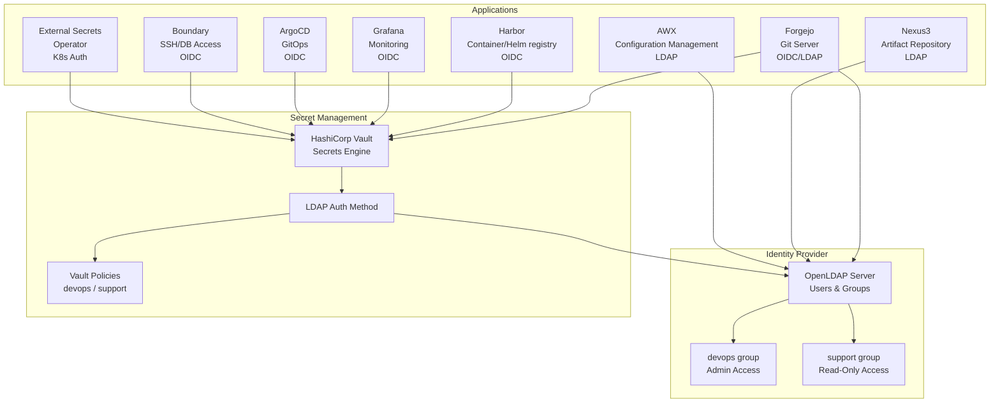

---

## Direct LDAP Authentication

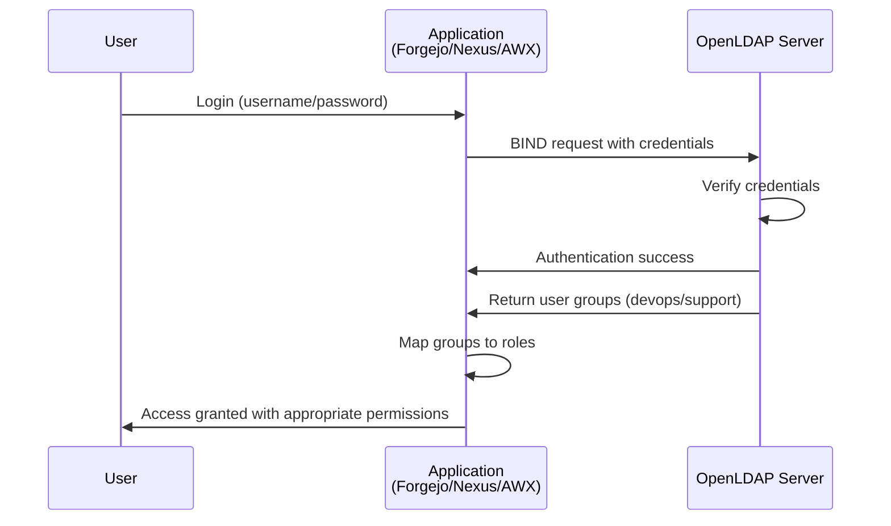

---

##### Vault OIDC Authentication Flow

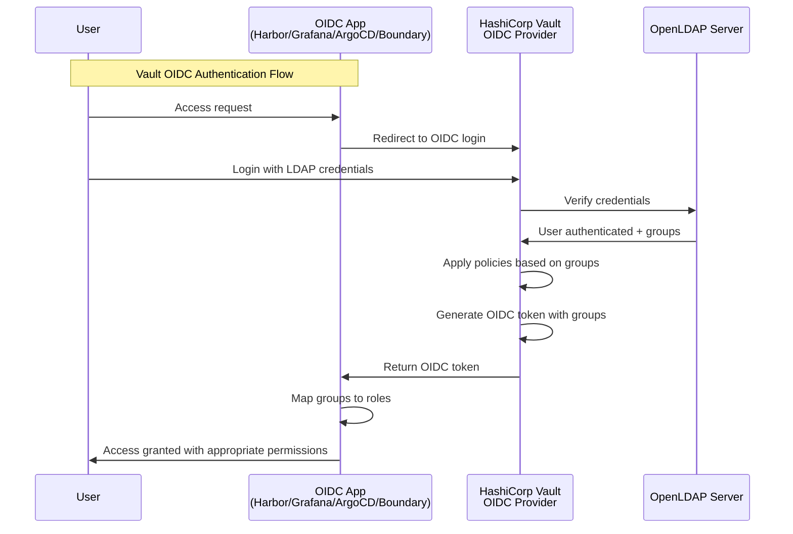

---

### Boundary Access Flow

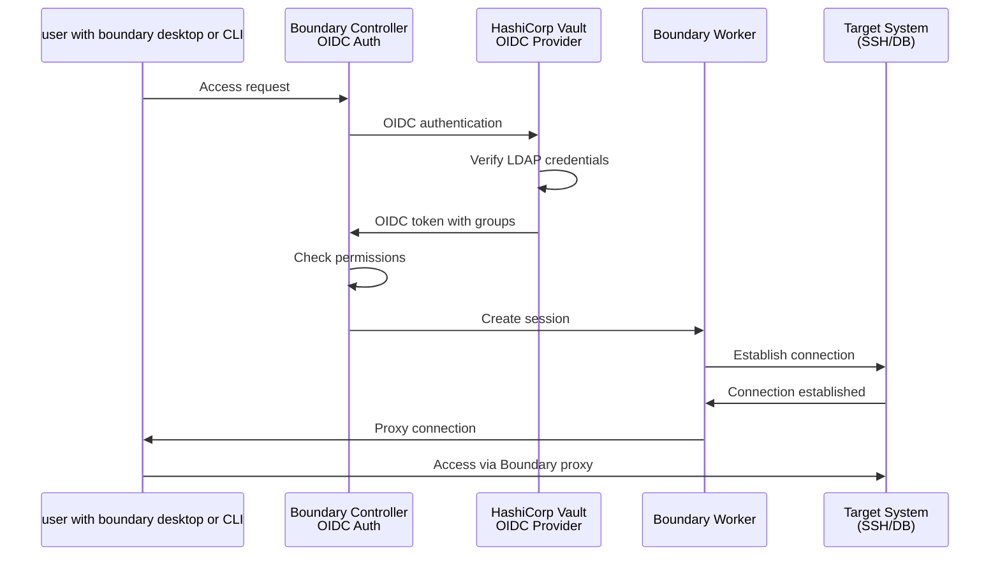

---

### Kyverno Policy Enforcement Flow

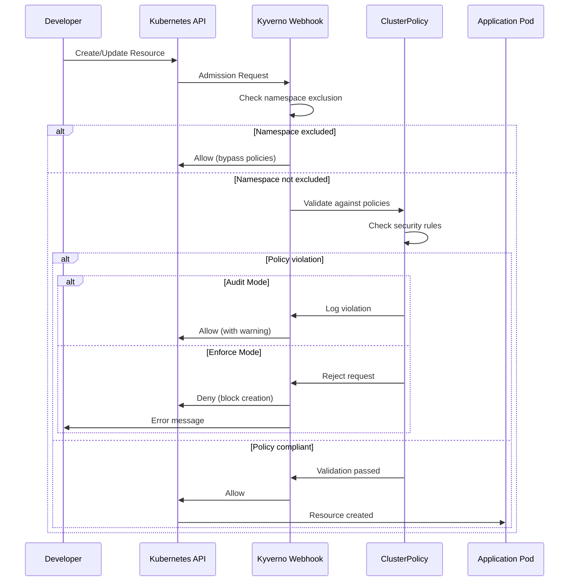

---

# Идентификация и безопасность

## Boundary Use Cases

### SSH Access
- Безопасный доступ к серверам без управления SSH ключами
- Централизованное управление доступом
- Аудит всех SSH сессий
- Временные сессии с автоматическим истечением

### Database Connection
- Защищённые подключения к базам данных
- Динамические credentials через Vault
- Аудит всех database подключений

---

# CI/CD платформа

## Forgejo

- Self-hosted Git сервис (Gitea fork)
- Git repositories
- Pull Requests, Issues
- OIDC/LDAP интеграция
- SSH доступ через LoadBalancer

## Forgejo Runner

- CI/CD runners для Forgejo
- Docker-in-Docker
- Act runner для GitHub Actions-совместимых workflows

---

# CI/CD платформа

## ArgoCD

- GitOps continuous delivery
- Declarative GitOps workflow
- OIDC SSO через Vault
- Forgejo/Gitea интеграция
- AppProjects для организации
- Web UI + CLI

---

# CI/CD платформа

## Renovate

- Автоматизация обновления зависимостей
- Автообновление Docker images, Helm charts, Java, Node
- Интеграция с Forgejo
- Dependency Dashboard

---

# Мониторинг и логирование

## VictoriaMetrics Stack

### Компоненты:
- **VMSingle** - хранение метрик (50Gi по умолчанию)
- **VMAgent** - сбор метрик из кластера
- **VMAlert** - alerting rules
- **Grafana** - визуализация с OIDC интеграцией

### Возможности:
- Предустановленные Kubernetes dashboards
- Node Exporter и kube-state-metrics
- ServiceMonitor для автоматического discovery
- Интеграция с Loki для log correlation

---

# Мониторинг и логирование

## Loki Stack

### Компоненты:
- **Loki** - индексирование и хранение логов
- **Promtail** - DaemonSet для автоматического сбора логов
- **Gateway** - load balancing

### Возможности:
- S3 backend (внешний MinIO) для хранения
- Retention: 30 дней (настраивается)
- Интеграция с Grafana (автоматический datasource)
- LogQL для мощных запросов
- Log correlation с метриками

---

# Monitoring Flow

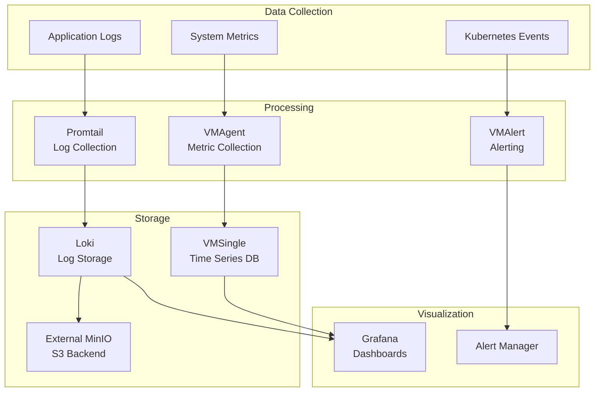

---

# Backup и восстановление

## Velero

- Автоматизация backup и restore для Kubernetes
- Scheduled backups (daily/weekly)
- S3-совместимое хранилище (внешний MinIO)
- Restic для volume backups
- Настраиваемая retention policy
- Выборочный backup по namespaces

### Backup стратегия:
- Daily backup в 2:00 AM
- Weekly backup в 3:00 AM (воскресенье)
- Retention: 30 дней (daily), 60 дней (weekly)
- Namespaces: vault, harbor, forgejo, nexus3, openldap, postgresql, awx, dns-system

---

# Disaster Recovery

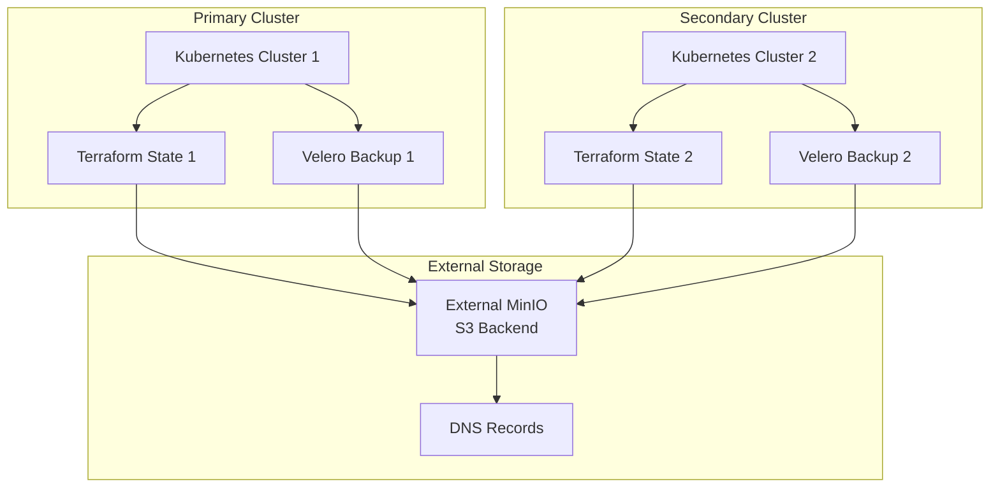

---

# Зависимости и интеграции

## Граф зависимостей (часть 1)

```
Базовая инфраструктура
  ↓
├─→ OpenLDAP
│     ↓
│   Vault (LDAP auth + OIDC)
│     ↓
│   ├─→ Forgejo (OIDC/LDAP)
│   │     ↓
│   │   Forgejo Runner
│   │     ↓
│   │   Renovate
│   │
│   ├─→ Harbor (OIDC)
│   ├─→ Grafana (OIDC)
│   ├─→ ArgoCD (OIDC)
│   ├─→ Boundary (OIDC)
│   └─→ External Secrets Operator (K8s Auth)
```

---

# Зависимости и интеграции

## Граф зависимостей (часть 2)

```
├─→ BIND9 → External DNS
├─→ MetalLB → Ingress Nginx
│
├─→ PostgreSQL
│     ↓
│   ├─→ Grafana
│   ├─→ Harbor
│   └─→ Boundary
│   └─→ AWX
│
├─→ VictoriaMetrics Stack
│     ↓
│   Loki (интеграция в Grafana)
│
└─→ Kyverno (независимый)
├─→ Cert-Manager (независимый)
```

---

# Зависимости и интеграции

## Внешние сервисы

### External MinIO S3
- Используется для:
  - Terraform/OpenTofu state backend
  - Velero backups storage
  - Loki chunks и ruler storage
  - Postgresql backups storage
  - Harbor image store
  - Nexus blob store

### CloudFlare (опционально)
- DNS-01 challenge для Let's Encrypt
- Публичные сертификаты

---

# Security Model

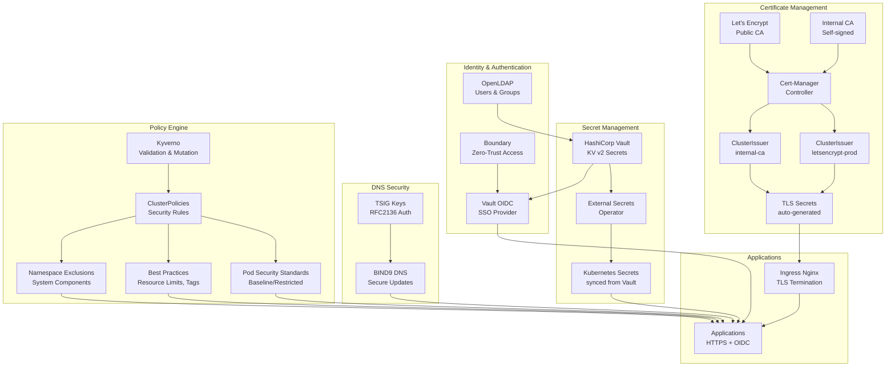

---

# Infrastructure as Code Flow

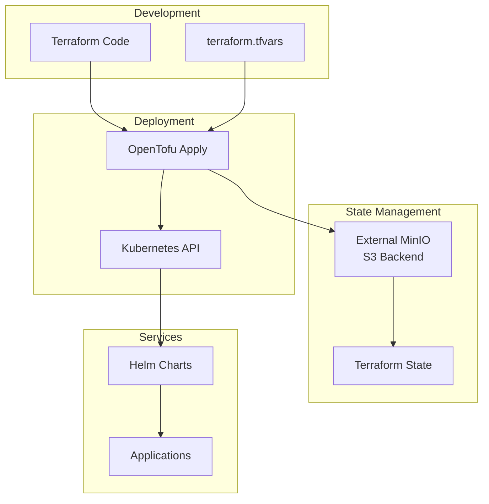

---

# Заключение

## Ключевые достижения

✅ **Полная автоматизация** - DNS, TLS, развертывание  
✅ **Infrastructure as Code** - Terraform/OpenTofu  
✅ **GitOps** - ArgoCD для декларативного управления  
✅ **Observability** - Метрики (VictoriaMetrics) + Логи (Loki)  
✅ **Security** - Policy engine (Kyverno) + Secret management (ESO + Vault)  
✅ **Backup** - Velero для disaster recovery  
✅ **Automation** - Renovate для обновлений  

---

# Заключение

## Преимущества

### 🚀 Автоматизация
- Zero-touch DNS
- Auto TLS
- Infrastructure as Code

### 🔒 Безопасность
- Централизованная аутентификация (LDAP + Vault)
- Policy enforcement (Kyverno)
- Secret management (ESO + Vault)

---

# Заключение

## Преимущества

### 📈 Масштабируемость
- Load Balancing
- Централизованное управление
- GitOps для быстрого развертывания

### 🛠️ Удобство разработки
- Автоматические DNS имена
- Простая маршрутизация
- Декларативное управление

---

# Production-Ready Infrastructure Stack

**Готово к продакшену!** 🚀

---
layout: center
class: text-center
---

# Спасибо за внимание!

**Вопросы?**
