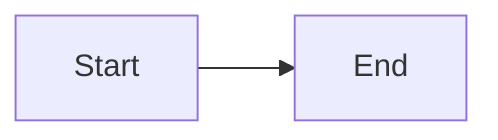
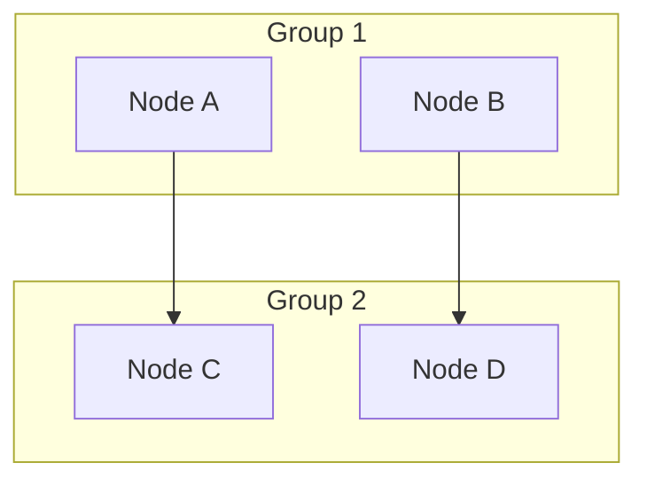
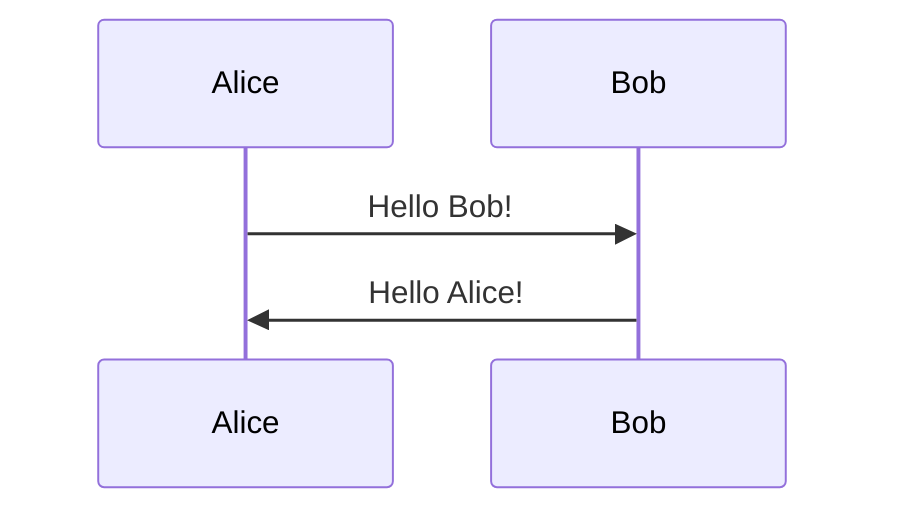
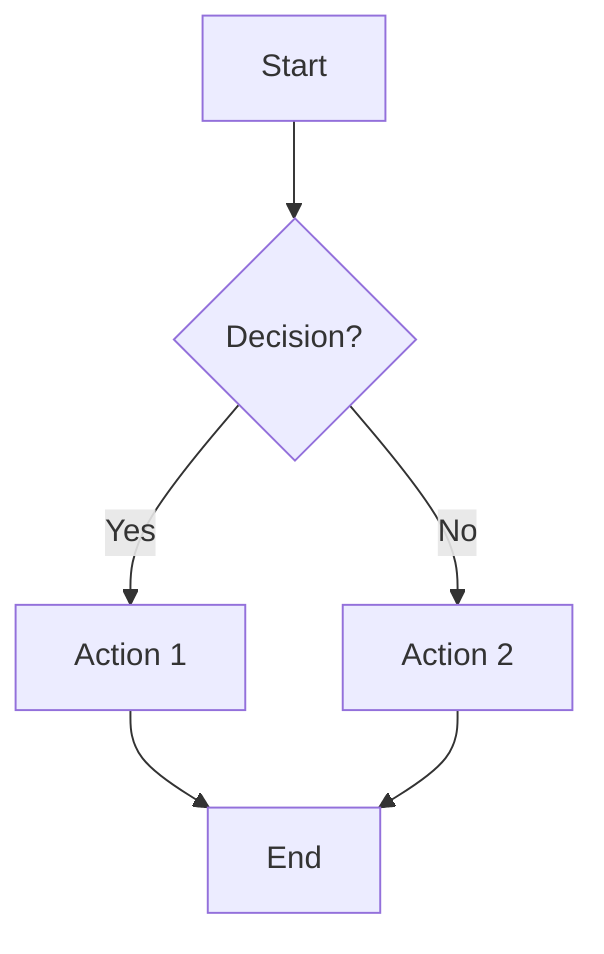
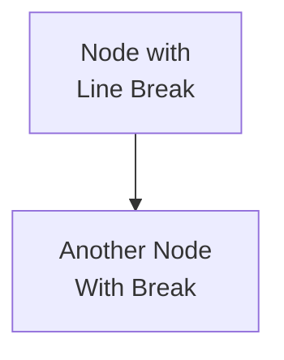

# Тест Mermaid диаграмм

## Простая диаграмма

```mermaid
graph LR
    A[Start] --> B[End]
```

---

## Диаграмма с подграфами

```mermaid
graph TB
    subgraph "Group 1"
        A[Node A]
        B[Node B]
    end
    subgraph "Group 2"
        C[Node C]
        D[Node D]
    end
    A --> C
    B --> D
```

---

## Sequence диаграмма

```mermaid
sequenceDiagram
    participant A as Alice
    participant B as Bob
    A->>B: Hello Bob!
    B->>A: Hello Alice!
```

---

## Flowchart

```mermaid
flowchart TD
    Start --> Decision{Decision?}
    Decision -->|Yes| Action1[Action 1]
    Decision -->|No| Action2[Action 2]
    Action1 --> End
    Action2 --> End
```

---

## Диаграмма с переносами строк

```mermaid
graph TB
    A[Node with<br/>Line Break]
    B[Another Node<br/>With Break]
    A --> B
```

